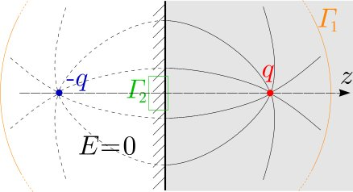
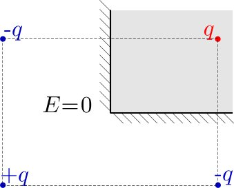
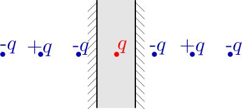
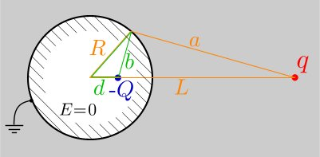
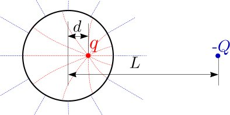
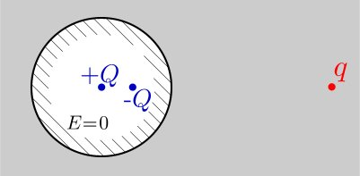
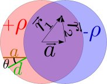

# 5. Images or roulette?

Suppose you are given a problem and you don't know how to really solve it; however, your intuition tells you that the answer is that and that (you can also call it "an educated guess"). Is such an answer acceptable? If you are an experimentalist, it would be perfectly fine: who cares how you got your equipment working, as long as it works! If you are a theoretical physicist, it would be not really good, but if you find some arguments to qualitatively motivate your answer, you can call it "a conjecture", and it will be better than nothing. If you are a mathematician, no-one will care about your guess-work. However, there are cases when a guess is as good as a methodically obtained result: when it is known (has been proved) that there is a unique solution to the problem, and you are able to show that your solution does, indeed, satisfy all the requirements.  Such an approach is acceptable even for mathematicians! In physics, this method is mostly known as the method of electrical images.

To begin with, let us consider the simplest and most classical problem on electrical images (the Problem 1): suppose there is an infinite conducting plane $z=0$ and at $z=a$ , there is charge $q$ . Find (a) the charge surface density of the induced charges $\sigma$ at $x=y=z=0$ ; (b) the interaction force between the plane and the charge; (c) the net charge induced at the conductor surface $Q =\int \sigma(x,y)dxdy$ .

Intuitively, it is quite clear that the problem is well-defined, ie. it should have a unique solution. Let us analyse it in mathematical details. First, the electrostatic field is everywhere potential ( $\oint \vec E\cdot d\vec r =0$ , or equivalently, $\vec\nabla\times \vec E=0$ ; just skip what is written in braces if you don't understand it) and second, in the half-space $z>0$ , except for the point $\vec r =(0,0,a)$ , it is source-free ( $\oint \vec E\cdot d\vec S =0$ , or equivalently, $\vec\nabla\cdot \vec E =0$ ). These two conditions form a closed set of differential equations (in partial derivatives; more specifically, owing to the first condition, the electric field can be expressed via an electrostatic potential, $\vec E = \vec\nabla \phi$ , due to the second condtition, $\vec \nabla ^2 \phi =0$ ). Now, in order to have a unique solution, we need appropriate boundary conditions (which correspond to initial conditions for ordinary differential equations) at the boundary of that region of space where we need to find the field (this region is marked with grey in the Fig.). In the case of our problem, the boundary consists of three parts: (a) the conductor surface $z=0$ , where $\phi=\mbox{Const}$ ; (b) the point occupied by the charge $\vec r =(0,0,a)$ , around which $\oint \vec E\cdot d\vec S = \frac 1{4\pi\varepsilon_0} q$ ; (c) infinitely remote region $|\vec r| =\infty ,$ where $\phi=0$ . Comparing (a) and (c) we can conclude that at the conductor surface, $\phi = 0$ .

Mathematicians have proved that the problem of finding a potential source-free field ( $\vec \nabla ^2 \phi =0$ ) in a certain space region will have a unique solution, if each contiguous boundary segment $\Gamma_i$ of that space region has either (i) a fixed and known value of the potential $[\phi ( \vec r \in \Gamma_i)\equiv \phi_i]$ , or (ii) a constant (but unknown) value of the potential, and a known total flux of the field $[\phi ( \vec r \in \Gamma_i)=\mbox{Const},$ $\oint _{\Gamma_i} \vec E\cdot d\vec S = \frac 1{4\pi\varepsilon_0} q_i ]$ . Note that boundary itself is excluded from the region where we need to find the field; however, the points of the boundary are at a zero-distance from the region.

Using the mathematical terms, the formulation may seem somewhat obscure, but in physical terms, it is very simple: in order to have a unique solution to the problem of finding the electrostatic field in a certain region of space, the boundary can consist of two type of elements: (a) electrical charges, the values of which are known, and (b) electrical conductors, for which one value out of two needs to be given (the other value will be found as a part of the solution): (i) the net charge; (ii) the potential.

Now, if we look back at our problem, it is easy to see that everything is fine: we know the potential of the infinite conducting plane (the net charge is yet to be found), and the stand-alone charge is also known. What is left to do, is to construct such a field which will satisfy all the boundary conditions and is obtained as a superposition of fields which are know to be potential and source free in our space region (then, the superposition will be too, owing to the superposition principle, which is valid for linear differential equations, such as $\vec \nabla ^2 \phi =0$ ). As for the component-fields which we are going to use for the construction of the solution, we don't have much choice – we can use the fields of point charges, but the charges need to be placed outside the space region of interest, because the field of a point charge is not source free at that point where the charge resides. If necessary, we can use also a homogeneous constant field, or the field of a homogeneously charged rod (the rod needs to be outside the region).

For the first problem, the task is easy: it is just enough to place one virtual charge $-q$ at $\vec r =(0,0,-a)$ (blue in Fig.) to ensure that when superimposed to the field of the real charge $q$ at $\vec r =(0,0,a)$ , the resultant potential is zero at the entire surface of the conductor [since we keep a charge at $\vec r =(0,0,a),$ (red in Fig.), the boundary condition at that point is satisfied, too]. Note that in reality, there is no charge at $\vec r =(0,0,-a)$ : all the real charge is induced at the surface of the conductor, only the field in the region $z>0$ is as if there were a charge $-q$ at $\vec r =(0,0,-a)$ . To sum up, at $z<0$, the electric field $\vec E=0$   (we knew it from the very beginning!), and at $z>0$ , the electric field is such as if  there were a charge $-q$ at $z=-a$ .

In order to calculate the net charge induced at the surface of the conductor [question (c)], let us consider the flux of electric field through a very large sphere of diverging radius, centred around the charge (in Fig, orange circle $\Gamma_1$ ). In the region $z>0$ , the field is that of a dipole (the pair of red and blue charges in Fig), hence $|\vec E|$ vanishes as $1/r^3$ . Meanwhile, the surface area of the sphere grows as $r^2$ ; therefore, the field flux is $\propto 1/x$ , ie. becomes zero for an infinite sphere (here $\propto$ means "proportional to"). According to the Gauss law, this means that the sum of real charges inside the sphere is zero, which means that the net charge on the conductor surface must be equal to $Q=-q$ , to compensate the charge at  $\vec r =(0,0,a)$ . So, the real induced charge is equal to the image charge at $\vec r =(0,0,-a)$ . This is a universal result (consequence of the Gauss law): the sum of image charges inside a conductor with a given potential equals to the net charge induced on the surface of that conductor.

In order to answer the question (a), we consider a small cylindrical surface of a cross-section area $S$ and a negligible height, which is positioned at $\vec r=0$ , coaxial with the real and virtual charges (in Fig, green rectangle $\Gamma_2$ ). The electric field flux through that cylinder includes only the flux through that bottom of it which is turned towards the real charge (the side surfaces are small and the other bottom is inside the conductor, where $\vec E=0$ ): $ES=\frac 1{4\pi\varepsilon_0}\sigma S$ . Note that $\sigma S$ stands for the charge inside the cylinder, and $E=\frac q{2\pi\varepsilon_0a^2}$ is the field at $\vec r=(0,0,+0)$ , ie. the superposition of the fields of the real and virtual charges. So, we finally obtain $\sigma =-2q/a^2$ (we have prefixed '–' to reflect the fact that the induced surface charge is of opposite sign.

Finally, to answer the question (b), let us note that the electrostatic force acting on a charge depends only on the value of the electric field at the position of the charge (neglecting the field of the charge itself); since the field is such as if there were a charge $-q$ at $\vec r=(0,0,-a)$ , the force must be also the same what would be if there were a charge $-q$ at $\vec r=(0,0,-a)$ , ie. $F=q^2/16\pi\varepsilon_0 a^2$ .

Now it is becomes also clear, why the method is called the method of electrical images: plane conductor surfaces work as mirrors: we need to put virtual charges in the position of those optical images of the real charges which would appear, if the conductor surfaces were mirrors. This is valid not only for a single infinite conductor surface, but also for configurations depicted in Figures below.

However, the analogy is not perfect, and does not work rigorously in the case of curved surfaces. It appears that in the case of spherical surfaces, the situation is actually better than in the case of geometrical optics when the images are not perfect points, due to spherical abberations; this will be discussed in next paragraphs.

Now, let us study the electric field created by a grounded conducting sphere of radius $R$ , together with a point charge $q$ at a distance $L$ from the centre of the sphere (Problem 2). Let us take the origin at the centre of the sphere; then the region where we need to find the electric field is $|\vec r|>R$ , excluding the point where the external charge resides. The boundary conditions are as follows: a fixed charge at $\vec r=(0,0,L)$ , and $\varphi =0$ at $|\vec r|=R$ (which are good enough to provide a unique solution, cf criteria given above).  Solving this problem using the method of electrical images is possible owing to a non-trivial mathematical fact: for an arbitrary pair of positive an negative point charges, the surface of zero potential has the shape of a sphere (in the degenerate case of equal by moduli charges, the sphere has an inifinite radius, ie. becomes a plane). So, we expect that for any $q, L$ , and $R$ (see Fig.), we can find such $Q$ and $d$ that for any point on the sphere,

$\displaystyle k\frac q{a}-k\frac Q{b}=0.$

In order to prove that this, indeed, the case, let us note that the green and orange triangles (in Fig. below) have one common angle, ie. the position of the image charge can be chosen so that the green and orange triangles will be similar to each other. This will happen if the ratios of the respective sides of the green and orange triangles are equal, ie. if $\frac LR=\frac Rd \Rightarrow d=R^2/L$ . Furthermore, due to the similarity of the triangles, $\frac ab=\frac LR$ ; combining this with the condition $k\frac q{a}=k\frac Q{b}$ results in $\frac Qq=\frac ba =\frac RL \Rightarrow Q=q\frac RL$ . Since these values of $d$ and $Q$ are independent of $a$ and $b$ , the green and orange triangles remain similar (with the same similarity ratio $\frac RL$ ), and  the condition $k\frac q{a}=k\frac Q{b}$ remains satisfied for any point on the sphere. This means that indeed, with an image charge $Q=-q\frac rL$ , which is placed at the distance $d=\frac {R^2}L$ from the centre of the sphere towards the external charge, all the boundary conditions are satisfied, ie. this configuration of charges produces the actual  electric field outside the sphere. Also, we can conclude that the net charge induced on the surface of the grounded sphere equals to $Q=-q\frac RL$ .

Now we can easily solve a problem of reversed geometry (Problem 3): suppose there is a charge $q$ inside a hollow conducting charge-less sphere of radius $R$ ; we ask, what is the interaction force between the charge and the sphere, and what is the electric potential of the sphere.

For the inside region of the sphere, the boundary conditions are: (a) constant potential at the spere; (b) charge $q$ at the given point. It is easy to see that these conditions can be satisfied with the charge placement from the previous problem, only the real and image charges swap the places. So, we need to put an image charge $-Q$ at the distance $L=R^2/d$ from the centre of the sphere, with $Q=q\frac Rd$ . So, the interaction force is $F=kq^2Rd/(R^2-d^2)^2$ .

For the outside region of the sphere, the boundary conditions are: (a) constant potential at the spere; (b) net charge $q$ inside the sphere. It is easy to see that these conditions will be satisfied with a field created by a point charge $q$ at the centre of the sphere (the respective fieldlines are depicted as blue dotted lines in Fig.). Due to the uniqueness of the solution, this is the actual field outside the sphere; hence, the potential of is given by the potential of a point charge, $\varphi =-kq/R$ . A useful conclusion is that the charge distribution inside a closed conducting vessel cannot be determined by outside observations.

As a Problem 4, let us consider the interaction of an isolated electrically neutral conducting sphere with a point charge $q$ at distance $L$ from the centre of the sphere. The only difference from the Problem 2 is that the sphere is electrically neutral and isolated. From the solution of Problem 2 we know that putting image charge $-Q=-qR/L$ at distance $d=R^2/L$ from the centre of the sphere yields a zero potential for any point on the sphere. Now we can add more image charges inside the sphere, but we need to keep the sphere surface equipotential. The only place we can put an image charge and satisfy this condition, is the centre of the sphere. On the other hand, the net charge of the sphere is the sum of image charges; we already have the first image charge $-Q$ , hence, if we put a second image charge $+Q$ into the centre of the sphere, this condition will be satisfied, too!

Next, let us determine the surface charge density for a conducting cylinder, placed into a homogeneous electric field $E$ , which is perpendicular to the axis of the cylinder, also to used as the $z$ -axis (Problem 5). If there were a sphere instead of the cylinder, it could be studied as a limit case of Problem 4, when the point charge is at an infinite distance $L$ , with charge equal to $q=EL^2/k$ . In 2D geometry, however, point image charges (actually, homogeneously charged wires) are no good, because then the potential is a logarithmic function of the distance, and for the system of two parallel wires, there are no equipotential surfaces with the shape of a cylinder.

Solution to this problem, will be constructed step-by-step. First we find the electric field inside a dielectric cylinder of radius $R$ and homogeneous volume charge density $\rho$ ; we assume that the dielectric permeability $\varepsilon=1$ . Writing the Gauss law for a coaxial cylindrical surface of radius $r$ and height $h$ , we obtain $2\pi rh\varepsilon_0E=\pi r^2h\rho$ , from where

$\vec E=\rho\vec r/2\varepsilon_0$ .

Here we have used vector notation to express the fact that the electric field is radial ( $\vec r$ is a 2D vector laying in the $x-y$ -plane, pointing from the axis to the current point). The next step towards the solution is studying two cylinders of opposite volume charge densities $\pm \rho$ , and finding the electric field inside the region where the cylinders overlap (see Fig.). Using the last equation, we can write

$\displaystyle \vec E=\frac \rho {2\varepsilon_0}(\vec r_1-\vec r_2) = \frac \rho {2\varepsilon_0}\vec a$ .

The result is a constant vector, which means that the electric field inside the region of overlap is homogeneous. Now it becomes also clear, how to obtain the solution to the Problem 5: we take $r = R$ , and let $a\to 0$ and $\rho \to \infty$ in such a way that the product of the two will remain constant,

$\frac{\rho}{2\varepsilon_0} a=E \Rightarrow \rho a = 2\varepsilon_0E.$

The result will be a homogeneous electric field inside the cylinder, and no volume charge ( $+\rho$ and $-\rho$ cancel out). The region where the cylinders don't overlap becomes very thin, so that the volume charge $\pm \rho$ becomes a surface charge $\pm \sigma$ . The surface charge density $\sigma =\rho d$ , where $d=a\cos \theta$ is the thickness of the layer and $\theta$ is the polar angle between the electric field, and the radius vector pointing from the centre of the cylinder to the observation point, see Fig. Finally, what is left to do to obtain the electric field in the case of the Problem 5, is to add an  everywhere homogeneous electric field $-\vec E$ . Inside the cylinder, this cancels out the field created by the cylinders (but not outside). This field (the superposition of the homogeneous field $-\vec E$ and the fields of the two almost overlapping cylinders) satisfies all the boundary conditions. In fact, there is only one condition: near the outer surface of the cylinder, the perpendicular to the surface component of the field must vanish. This is, indeed, the case, because the tangential component of the electric field is zero inside the cylinder (due to our construction), and remains unchanged when the observation point crosses the thin surface charge layer (this is a consequence of the circulation theorem, written for a small loop embracing a piece of the surface charge).  Note that here we actually didn't need virtual image charges: we managed to guess directly the surface charge distribution

$\sigma = \rho a\cos\theta = 2\varepsilon_0E\cos\theta$ ;

due to the uniqueness of the solution, this is the real surface charge distribution. Note that outside the cylinder, the field is the same as if there were an ideal 2D dipole. Indeed, this field is the superposition of the fields of two cylinders of opposite volume charge; outside the cylinders, these fields are the same what would be if there were two wires of linear charge density $\alpha = \pm \rho \pi R^2$ ; in our case $a \to 0$ , ie. the distance between the wires approaches zero, ie. we result in an ideal 2D dipole, the momentum of which  is $d_{2D}=\alpha a=\rho \pi R^2a=2\pi\varepsilon_0ER^2$ .

In order to close the topic of Problem 5, let us note that the technique applied here can be also used for a conducting sphere in an homogeneous electric field, as well as for a superconducting cylinder in an homogeneous magnetic field. In the case of magnetic field, we need to find the surface current distribution; we use the superposition of two cylinders with counter-directed currents densities $\pm\vec j$ ; for a convenient vectorial representation we can express the magnetic inductions produced by the cylinders by using the cross product as $\vec B=\pm\frac 1{2\mu_0}\vec j \times \vec r$ (the induction in the region of overlap will be $\vec B=\frac 1{2\mu_0}\vec j \times \vec a$ ).

The last problem (Problem 6) of this mosaic tile is the problem of electromagnetic wave propagation between two perfectly conducting parallel plates, in which case near the plates, the tangential electric field is always zero. Let the plates be at positions $z=\pm \frac a2$ , and the let us try to find the form of waves, polarized along the $y$ -axis, and propagating in the direction of the $x$ -axis. Similarly to what we did in the case of the electrostatic problems above, we try to construct the solution using the fields which are known to satisfy the underlying equations. In fact, there is probably only one relevant field which we know – that of a plane electromagnetic wave:

$\displaystyle \vec E=\vec e_yE_0e^{i(k_xx+k_zz-\omega t)},$

where $\vec e_y$ denotes the unit vector along the $y$ -axis; the ratio of the circular frequency and wave vector equals to the speed of light, $\omega/\sqrt{k_x^2+k_z^2}=c$ . Note that when we express $E_y$ as a complex number, we assume that the real, physically observable quantity is only the real part of it; we keep the complex part just for convenience: then we can use exponential functions instead of sinusoidal functions, and exponential functions have very convenient mathematical properties. It should be emphasized that such complex representation works well only as long as we deal with linear superpositions (because the real part of a sum equals to the sum of real parts), ie. we don't need to deal with nonlinearity. Luckily, the Maxwell equations in vacuum are linear.

The idea is to construct a standing wave in $z$ -direction via a superposition of two plane waves:

$\displaystyle \vec E=\vec e_yE_0\left[ e^{i(k_xx+k_zz-\omega t)}+e^{i(k_xx-k_zz-\omega t)}\right]=\vec e_yE_0e^{i(k_xx-\omega t)}\left[ e^{ik_zz}+e^{-ik_zz}\right]=$

$\displaystyle =2\vec e_yE_0e^{i(k_xx-\omega t)}\cos(k_zz).$

Now it is easy to see that the boundary condition at $z=\pm \frac a2$ is satisfied, for instance, with $k_z=\frac \pi {a}$ :

$\displaystyle \vec E=2\vec e_yE_0e^{i(k_xx-\omega t)}\cos(\frac {\pi z}{a}).$

It should be noted that unlike with the previous problems, solution of this boundary value problem is not unique: here, the number of standing waves across the slit cannot be determined from the boundary conditions (it depends also on which wave source is placed in the slit. Nevertheless, since we have used valid solutions of the Maxwell equations for building our superposition, and the boundary conditions are satisfied, we can be sure that such a wave can, indeed, propagate in the slit.

It is also useful to study the dispersion relationship of such a wave – which propagates in the waveguide formed by the two plates. To that end, let us recall that

$\omega=c\sqrt{k_x^2+k_z^2}=c\sqrt{k_x^2+\pi^2/a^2}\Rightarrow v_{ph}=\omega/k_x=c\sqrt{1+\pi^2/(ak_x)^2}$ .

What might seem surprising is that such a phase velocity exceeds the speed of light. However, energy (and information) transfer rate is determined by the group velocity $v_g=d\omega/dk_x$ . To find the group velocity, let us rewrite the dispersion relation in the form $\omega^2/c^2=k_x^2+\pi^2/a^2$ , and differentiate it: $2\omega d\omega/c^2=2k_xdk_x$ , hence

$\displaystyle v_g=\frac {d\omega}{dk_x}=\frac{c^2}{\omega/k_x}=\frac{c^2}{v_{ph}}=\frac{c}{\sqrt{1+\pi^2/(ak_x)^2}}$ .

Finally, let us mention that such a method – finding the solution by guessing and using the uniqueness of the solution – is not limited to the problem of finding the electric field. Another possibility, for instance, is the problem of finding the current distribution in conducting media. In particular, the equivalent scheme proposed in IPhO-2002 problem No 2 can be derived using this technique.

—

Jaan Kalda, Academic Committee of IPhO-2012

---
*From Jaan Kalda's "Physics Solver's Mosaic", Academic Committee of IPhO-2012. Transcribed faithfully from the born-digital WordPress source (Wayback snapshot); inline math recovered from WP-LaTeX `alt` attributes.*
