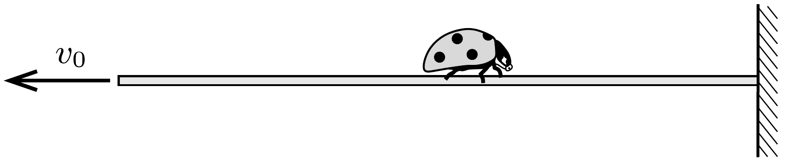

Egy méter hosszú, „szupernyúlékony” pókhálószál egyik végét függőleges falhoz erósítette egy pók. A szálon valahol egy szegett szárnyú katicabogár ül. A szál másik végét egyenletes $v_{0}=2 \mathrm{~cm} / \mathrm{s}$ sebességgel húzni kezdi az éhes pók, miközben ő maga nem mozdul el eredeti helyéről. Ugyanekkor a katica menekülni kezd a fal felé, a szálhoz képest állandó $v_{1}=5 \mathrm{~mm} / \mathrm{s}$ sebességgel.

a) Vajon eléri-e a katica a falat?
b) Hogyan módosul a feladat megoldása, ha a pók nem marad ugyanazon a helyen, hanem a pókhálószál végével együtt mozog?
