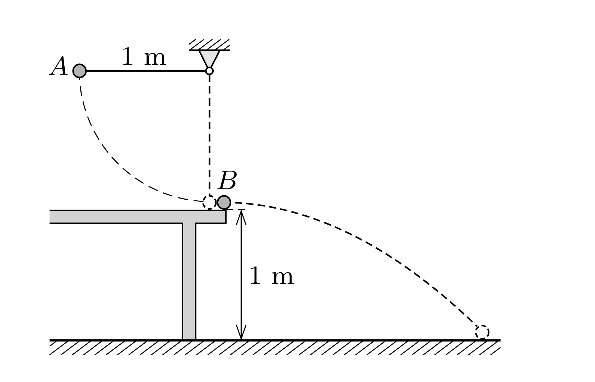

Egy 1 méter magas asztal szélén kicsiny acélgolyó nyugszik. Egy másik acélgolyót, amely egy 1 méteres fonálinga nehezéke, az ábrán látható módon kezdősebesség nélkül indítva nekiütköztetjük az asztalon levőnek. A golyók tömege egyforma, ütközésük rugalmas.

- a) Melyik golyó mozog hosszabb ideig?
- b) Melyik golyó tesz meg hosszabb utat?

(A $B$ jelú golyó mozgását csak a földet érés pillanatáig vizsgáljuk.)
