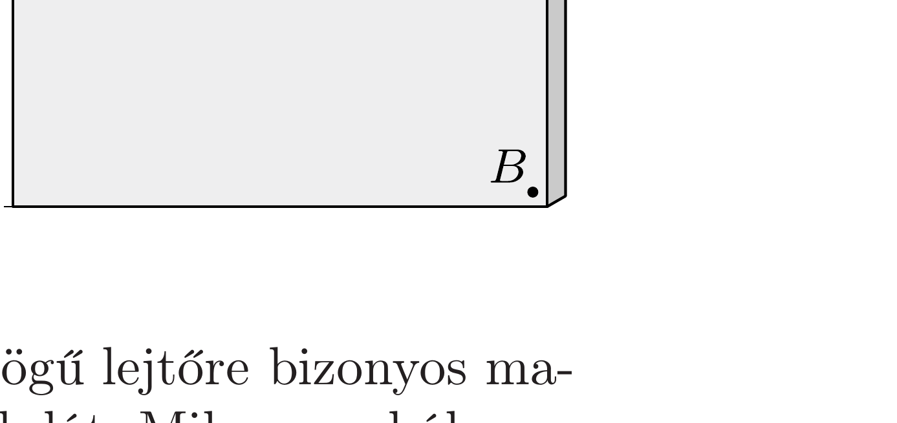

Egy függőlegesre állított rajztáblába szögeket verünk. Az ábrán látható $A$ pontból elejtünk egy kicsiny acélgolyót, amely a szögeken rugalmasan pattogva eljut a $B$ pontba. (Az ábrán a szögek nem láthatók!)
- a) Lehetséges-e, hogy a golyó hamarabb jut el az $A$ pontból a $B$ pontba, mintha a legrövidebb úton, vagyis az $A B$ egyenesen súrlódásmentesen csúszott volna?
b) Eljuthat-e a golyó 0,4 másodpercnél hama-

rabb a $B$ pontba?
