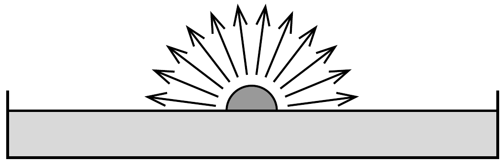

Képzeljünk el egy szökőkutat, amelynek kicsiny szórófeje a szökőkút medencéjének vízfelszínén található. A szórófej félgömb alakú, amin nagyon sok, egyenletesen elosztott kicsiny lyuk van, melyeken minden irányban ugyanakkora sebességgel lövell ki a víz. Milyen alakú lesz a kiáramló vízsugarakból képződő vízbúra? (Feltehetjük, hogy a vízsugarak nem találkoznak.)

