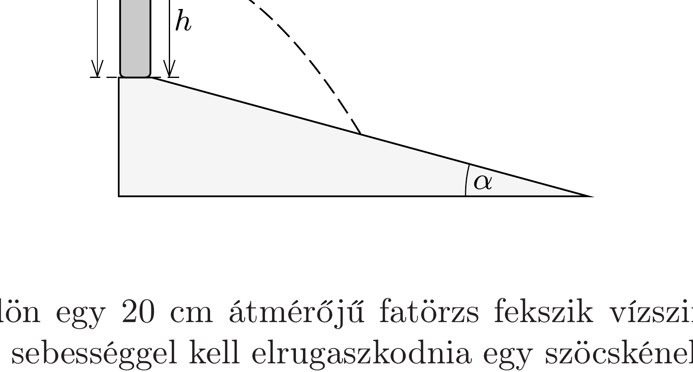

Egy hosszú, $\alpha$ hajlásszögú lejtő tetején álló henger alakú edényben $H$ magasságban áll a víz. Az edény aljához képest milyen $h$ magasságban kell lyukat fúrnunk a henger oldalán, ha azt akarjuk, hogy a kilövellő vízsugár a lehető legtávolabb érje el a lejtőt, és mekkora ez a távolság?

