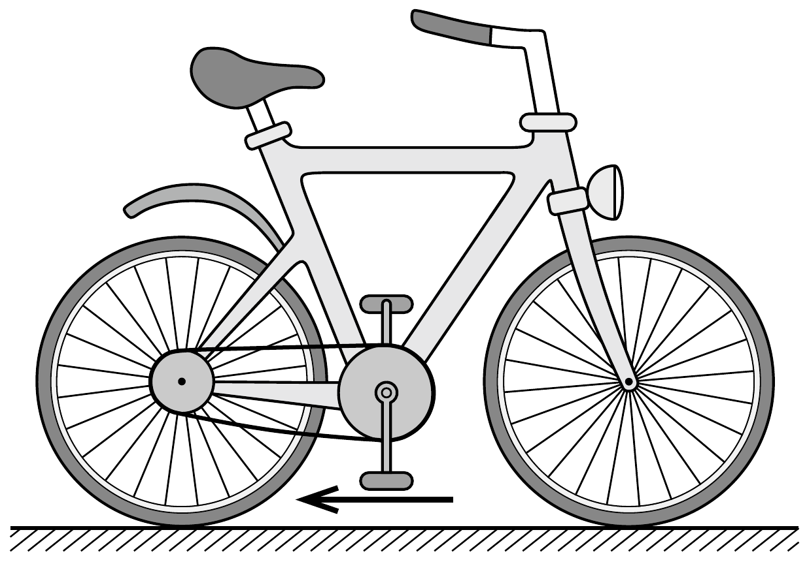
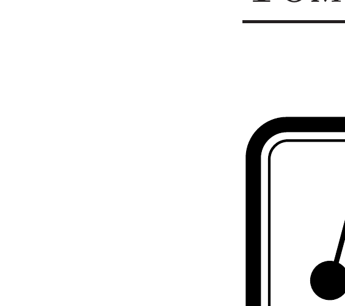

A járdán állva éppen csak annyira fogjuk a kerékpárunkat, hogy az ne tudjon eldőlni. A pedál hajtókarja függőleges. Barátunk a kerékpár mellett térdelve az alsó helyzetében levő pedált a kezével a hátsó kerék irányába kezdi tolni.
- a) Merrefelé mozdul el az alsó helyzetú pedál a talajhoz képest?
- b) Merre indul el a kerékpár?

(A súrlódás elegendően nagy ahhoz, hogy a hátsó kerék ne csússzon meg.)

\section*{Tömegpontok dinamikája}
