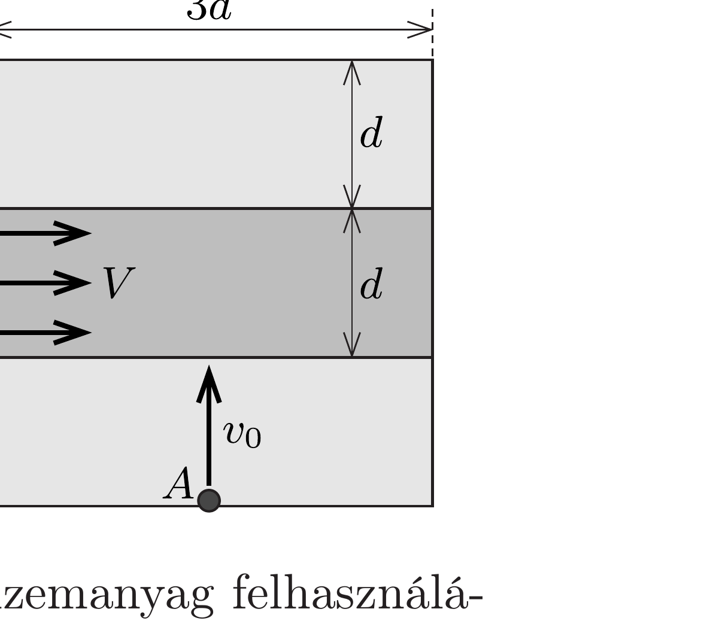

Egy vízszintes, négyzet alakú, $3 d=3 \mathrm{~m}$ oldalélú kísérletező asztal felülete sík. Az asztal $d=1 \mathrm{~m}$ szélességú középső sávját egy állandó $V=3 \mathrm{~m} / \mathrm{s}$ sebességgel mozgó (végtelenített) gumiszalag képezi, amely pontosan illeszkedik az asztallap nyugvó felületéhez.

Az asztal egyik szélének közepére (az ábrán látható $A$ pontba) egy kicsiny, lapos korongot fektetünk, majd $v_{0}=4 \mathrm{~m} / \mathrm{s}$ sebességgel elindítjuk a futószalagra merőleges irányban. A korong és az asztallap álló része közötti súrlódás elhanyagolható, míg a korong és a gumiszalag közötti csúszási súrlódási együttható $\mu=0,5$.

Hol esik le a korong az asztalról?

