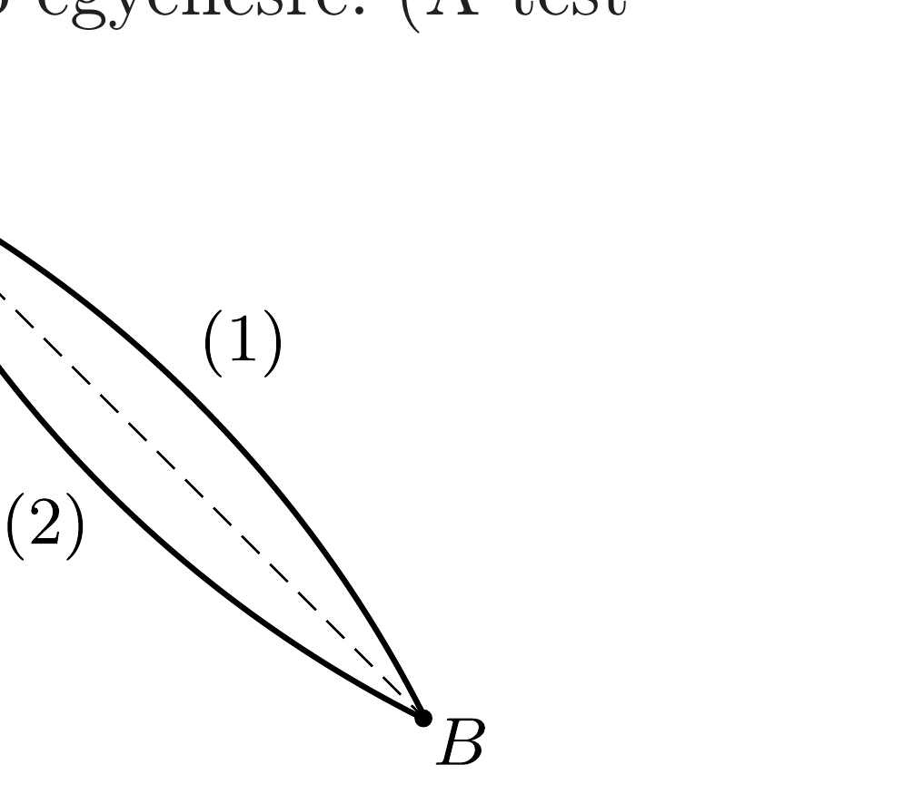
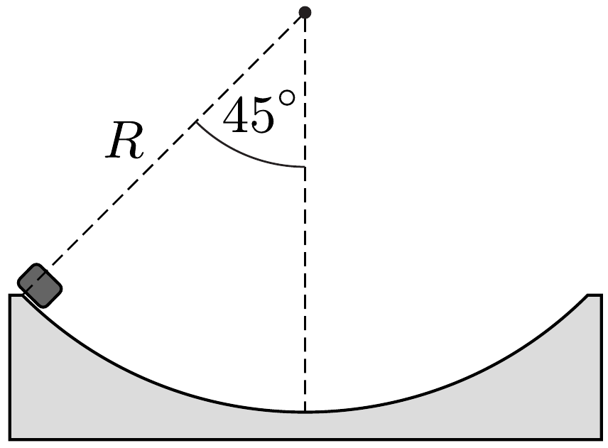

Egy kis test az ábrán látható két lejtőn csúszhat le az $A$ pontból a $B$ pontba. A pályák függőleges síkban fekvő körívek, amelyek szimmetrikusak az $A$ és $B$ pontokon átmenő, a vízszintessel $45^{\circ}$-os szöget bezáró egyenesre. (A test mozgása során sehol nem válik el a pályától.)
a) Melyik pályán ér le hamarabb a kis test, és mit mondhatunk a végsebességekről, ha nincs súrlódás?
b) Mit állíthatunk a végsebességekről akkor, ha a súrlódás nem hanyagolható el, és a súrlódási együttható mindkét pályán ugyanakkora?

