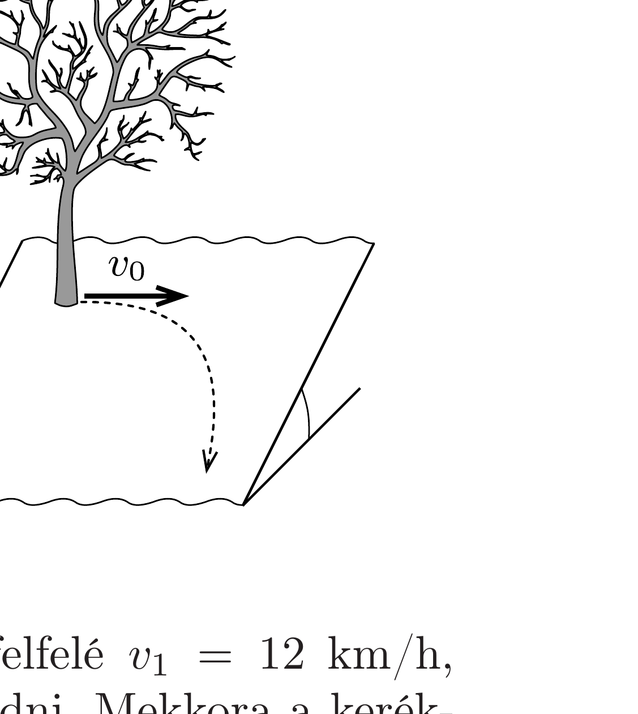

Nagy kiterjedésú, síknak tekinthető lejtős domboldalon áll két fiú. A talaj annyira jeges, hogy már a legkisebb lendületvétel után egyenletes sebességgel csúsznának lefelé.

Az egyikük (egy fához kapaszkodva) tréfából $v_{0}=1 \mathrm{~m} / \mathrm{s}$ vízszintes kezdősebességgel meglöki a társát, aki változó nagyságú és változó irányú sebességgel lecsúszik a lejtőn. Mekkora lesz a végsebessége, ha a légellenállás elhanyagolható, és a súrlódás független a sebességtől?

