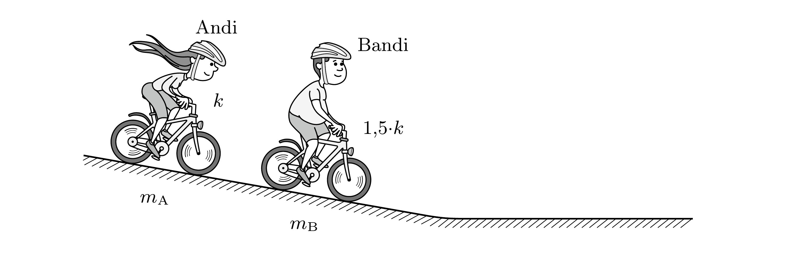

Andi és Bandi „gurulásos versenyt” rendeznek egy elegendően hosszú, állandó hajlásszögü lejtőn. Mindkettőjük biciklije ugyanolyan, és egyikük sem hajtja a kerékpárját. Andi 50 kg, Bandi 100 kg tömegú, a kerékpár tömege pedig 10 kg. Bandi légellenállása (a túlsúlyával összefüggő nagyobb „mérete“ miatt) másfélszer akkora, mint - ugyanakkora sebesség esetén - Andié. Melyikük gurul messzebbre a lejtőhöz csatlakozó vízszintes úton?

(Feltételezhetjük, hogy a kerékpárosokat a sebesség négyzetével arányos közegellenállási erő, továbbá a csapágyak súrlódása és a gördülő ellenállás fékezi. Az utóbbiakat kezelhetjük úgy, mintha valamekkora $\mu$ „effektív” súrlódási együtthatónak megfelelő csúszó súrlódás lépne fel.)
