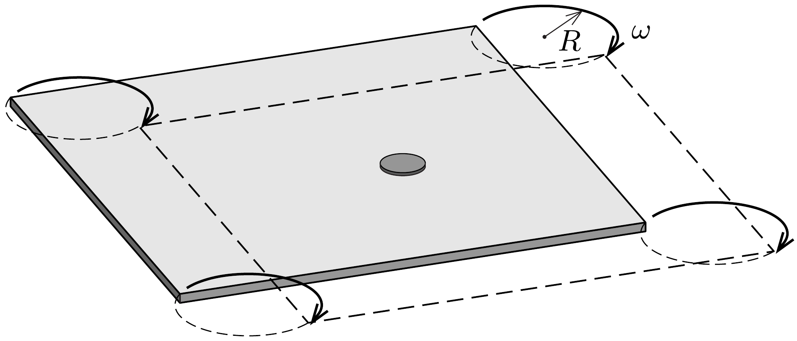

Vízszintes helyzetú, elegendően nagy méretú, téglalap alakú rajztáblán egy begrafitozott felületű, kicsiny pénzérme fekszik. A rajztáblát saját síkjában mozgatni kezdjük úgy, hogy középpontja $R$ sugarú körön haladjon $\omega$ szögsebességgel, miközben oldalai az eredeti helyzetükkel mindvégig párhuzamosak maradnak. Az érme és a rajztábla közötti súrlódási együttható $\mu$, melynek értéke elég kicsi ahhoz, hogy az érme folyamatosan csússzon.

Hogyan mozog az érme hosszabb idő után? Milyen nyomot hagy eközben a rajztáblán?
