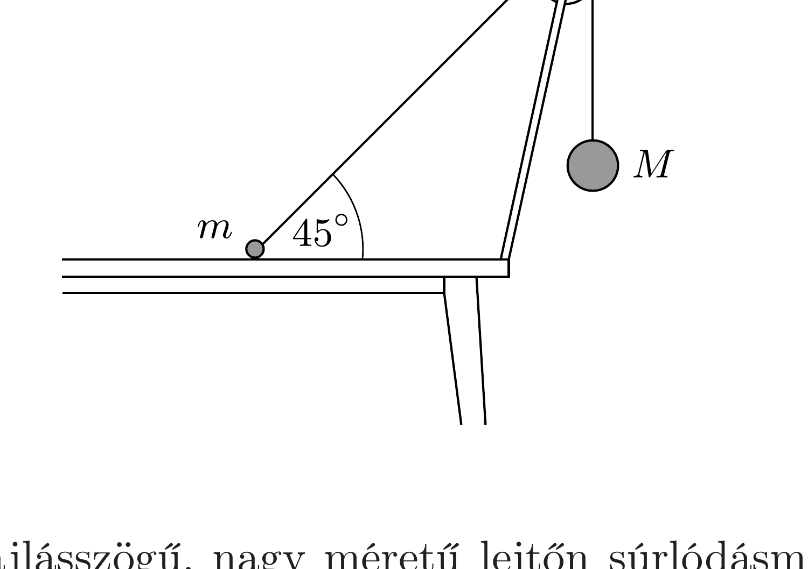

Az $m$ és $M$ tömegü, gömb alakú testeket elhanyagolható tömegü csigán átvetett súlytalan fonál köti össze. A két testet az ábrán látható helyzetben tartjuk, és egy adott pillanatban mindkettőt elengedjük. Az $M$ tömeg sokkal - pl. ezerszer - nagyobb, mint $m$. Az asztallap és az $m$ tömegú test között a súrlódás elhanyagolható. Elválik-e az elengedést követő pillanatban az $m$ tömegü test az asztallaptól?

