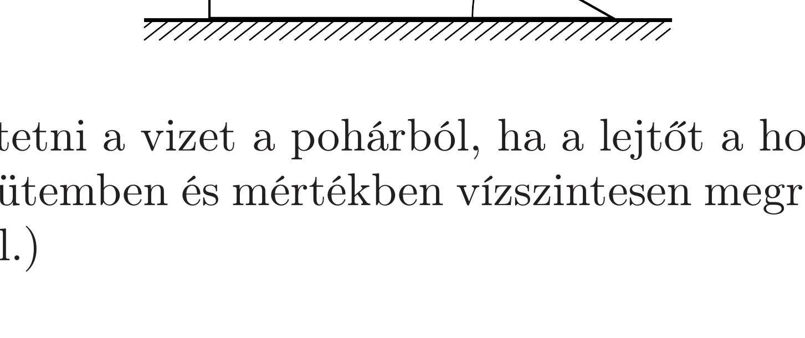

Egy $\alpha$ hajlásszögü, nagy méretú lejtőn súrlódásmentesen csúszik le egy ék, melyen egy (az ékhez rögzített) pohár, abban pedig víz található. (A lejtő tömege $M$, az ék, a pohár és a víz együttes tömege pedig $m$.) Milyen szöget fog bezárni a vízfelszín (kellően hosszú idő múlva) a lejtő síkjával, ha
- a) a lejtő rögzített,
- b) a lejtő szabadon mozoghat egy vízszintes síklapon?

Vizsgáljuk meg az $m \gg M$ esetet is!

Ki tudjuk-e lötyögtetni a vizet a pohárból, ha a lejtőt a hozzáerősített fogantyúnál fogva alkalmas ütemben és mértékben vízszintesen megrázzuk? (Az ék nem emelkedik fel a lejtőről.)
