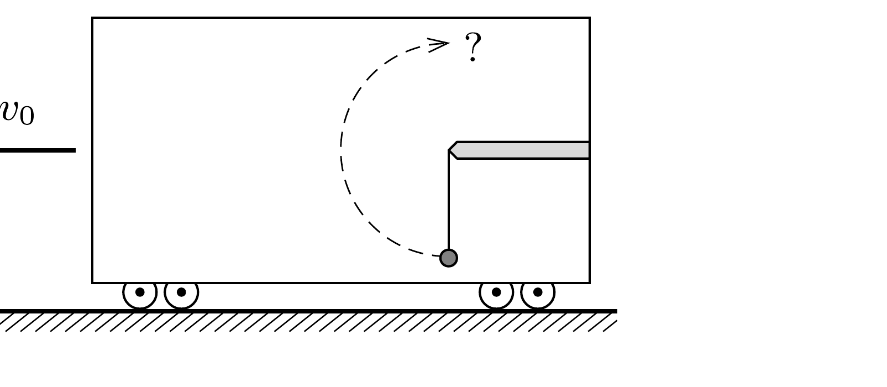
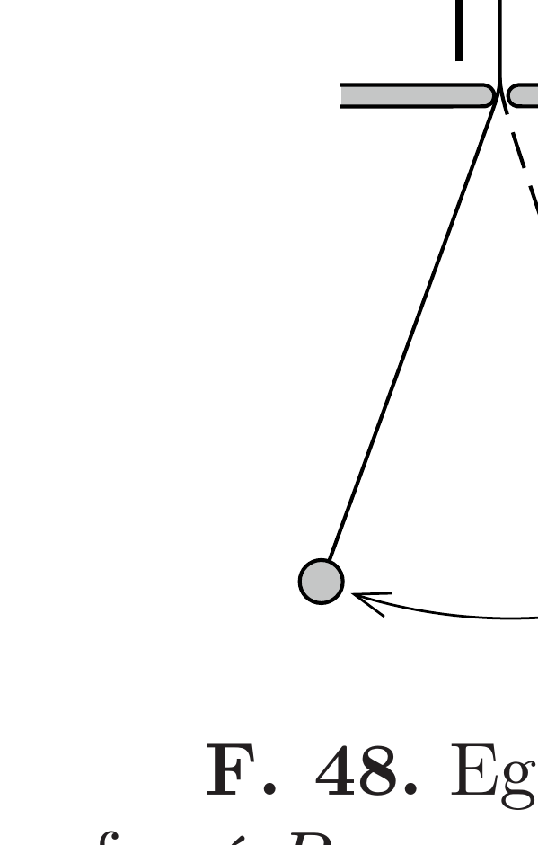

Vonatszerelvények ütközését vizsgáló próbapályán $v_{0}$ sebességgel haladó vasúti kocsiban hajlékony fonálon súlyos test függ. A kocsit bizonyos ideig igen erósen, de egyenletesen fékezve megállítják. Átfordul-e az inga a felső holtpontján?

