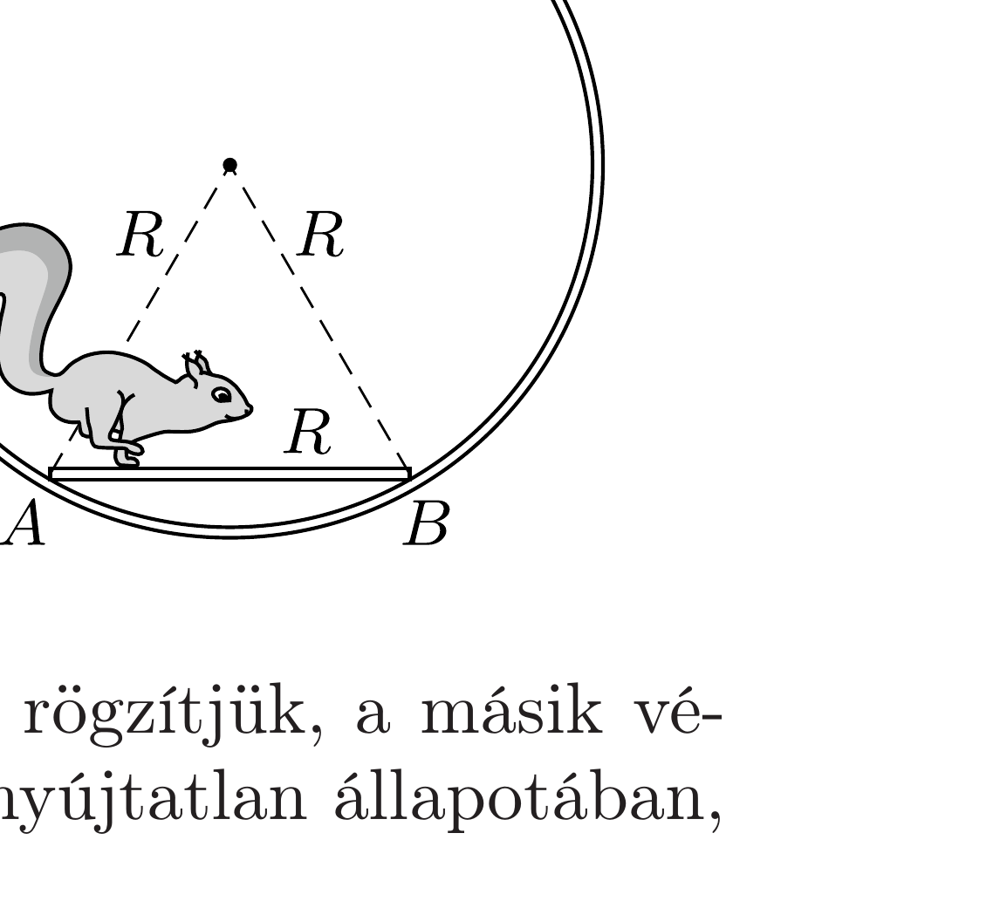

Egy rögzített tengely körül könnyen forgó $R$ sugarú mókuskerékbe $R$ hosszúságú létrát szereltünk. Egy olyan pillanatban, amikor a kerék éppen nyugalomban van és a létra vízszintes, a mókus elindul az $A$ pontból, és úgy fut át a létrán a $B$ pontba, hogy közben a kerék mozdulatlan marad. Hogyan kell a mókusnak mozognia? Mennyi idő alatt fut át a létrán, ha $R=0,5$ méter?

