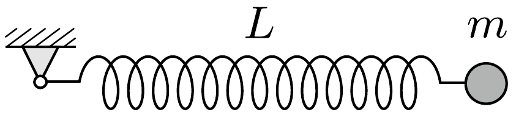

Egy könnyú, laza rugó egyik végét csuklósan rögzítjük, a másik végére pedig egy $m$ tömegú testet erósítünk, majd a rugót nyújtatlan állapotában, vízszintes helyzetből elengedjük.

Mekkora lesz a rugó hossza abban a pillanatban, amikor éppen függőleges helyzetú? (A rugó nyújtatlan hossza $L$, direkciós állandója $D$. A rugó „lazasága" annyit jelent, hogy $m g \gg D L$. A rugóerő mindvégig arányos a megnyúlással.)
