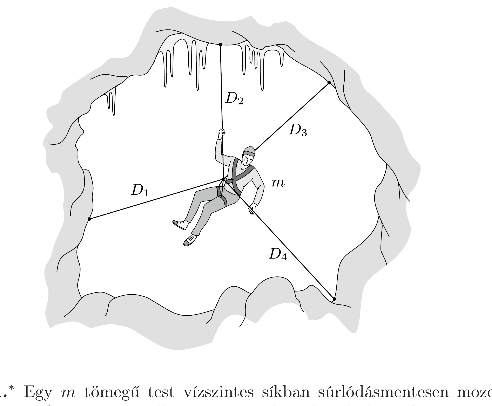

Egy cirkuszi artistából lett sziklamászó ideális pihenőhelynek látszó barlanghoz érkezik. Úgy dönt, hogy egy-egy különlegesen nyúlékony gumikötéllel a sziklafalba erósített négy kampóhoz kapcsolja magát, és így tölti az éjszakát. A gumikötelek eredeti hossza a megnyúlt hosszhoz képest elhanyagolható, rugalmas viselkedésük a $D_{1}=150 \mathrm{~N} / \mathrm{m}, D_{2}=250 \mathrm{~N} / \mathrm{m}, D_{3}=300 \mathrm{~N} / \mathrm{m}$ és $D_{4}=400 \mathrm{~N} / \mathrm{m}$ rugóállandókkal jellemezhető. A sziklamászó tömege $m=70 \mathrm{~kg}$.

Mekkora a sziklamászó egyensúlyi helyzet körüli kis rezgéseinek periódusideje, és függ-e a kitérés irányától?

