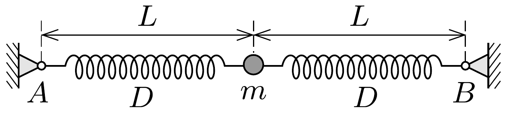

Egy $m$ tömegú test vízszintes síkban súrlódásmentesen mozoghat. A testet két egyforma, $D$ rugóállandójú rugóval az ábrán látható $A$ és $B$ pontokhoz kapcsoltuk. Ekkor a rugók nyújtatlanok, hosszuk $L$.
a) Mekkora eró hat a testre, ha az $A B$ szakaszra merőlegesen $x$ távolsággal kitérítjük? Hogyan közelíthető ez az erő kis kité-

rések esetén?
b) Mekkora a rezgésidő 2 cm-es amplitúdó esetén, ha 1 cm-es amplitúdónál a rezgés periódusideje 2 s, és $A B \gg 1 \mathrm{~cm}$ ?
