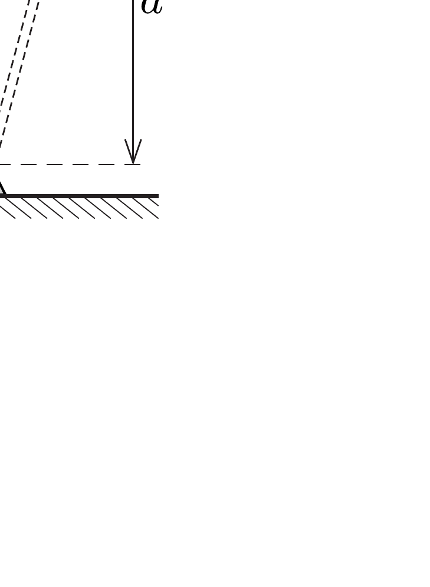

Alsó végénél tengelyezett, függőlegesen tartott rúd ütközővel van ellátva, melyen kicsiny gyöngy nyugszik, a tengelytől $d$ távolságban. A rudat az eredeti helyzete körül kicsiny $\theta_{0}$ szögamplitúdójú harmonikus rezgésbe hozzuk az ábra szerint. Mekkora legyen a rezgés frekvenciája, hogy a gyöngy lerepüljön a rúdról? (A súrlódás elhanyagolható.)

