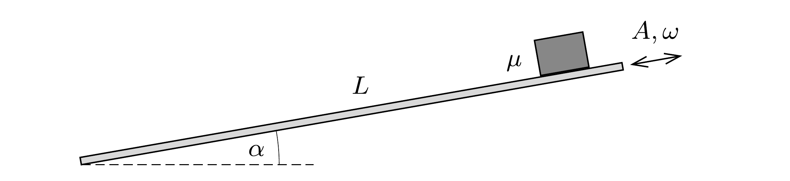

Egy $L=6 \mathrm{~m}$ hosszúságú, merev deszkalap síkja a vízszintessel állandó, $\alpha=10^{\circ}$-os szöget zár be. Az így kialakított lejtő tetejére egy kis hasábot helyezünk. A deszkát a lejtésvonalával párhuzamos irányban $A=1 \mathrm{~mm}$ amplitúdóval és $\omega=500$ 1/s körfrekvenciával harmonikusan rezgetni kezdjük. A csúszási és a tapadási súrlódási együttható értéke egyaránt $\mu=0,4$. (A hasáb a mozgás során nem borul fel, meg sem billen, alsó lapja mindvégig a lejtőn marad.)

Becsüljük meg, mennyi idő alatt éri el a hasáb a lejtő alját!

\section*{Gravitáció, bolygómozgás}
