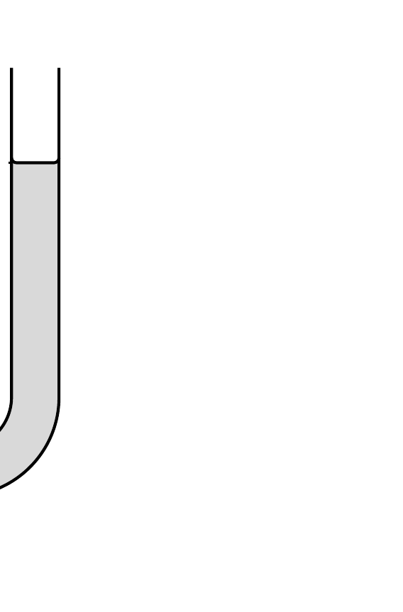

Vajon hol nagyobb a gravitációs gyorsulás, a Föld felszínén, vagy 10 km mélyen a föld alatt? (A gömbszimmetrikusnak tekinthető Föld átlagsürúsége $5,5 \mathrm{~g} / \mathrm{cm}^{3}$, a földkéregé pedig $3 \mathrm{~g} / \mathrm{cm}^{3}$.)

