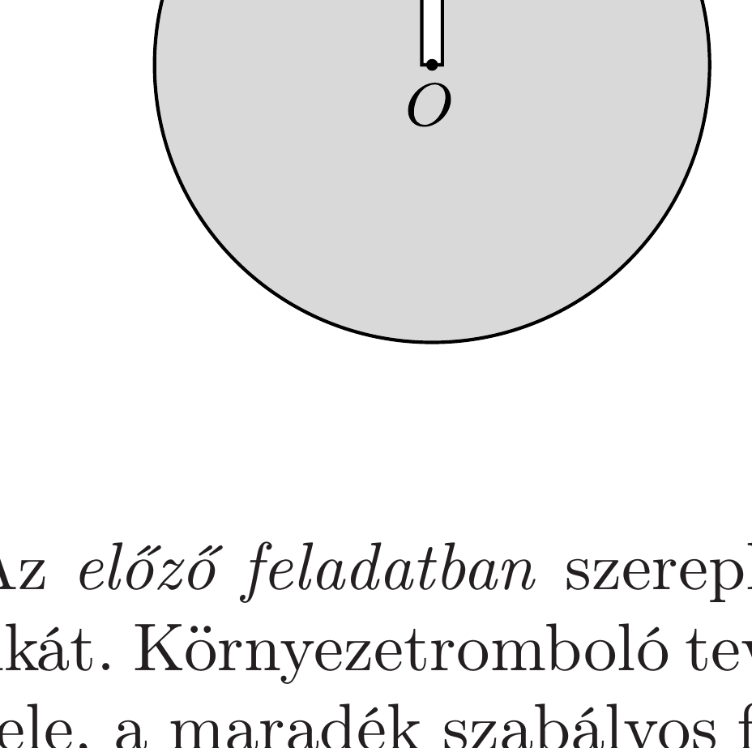
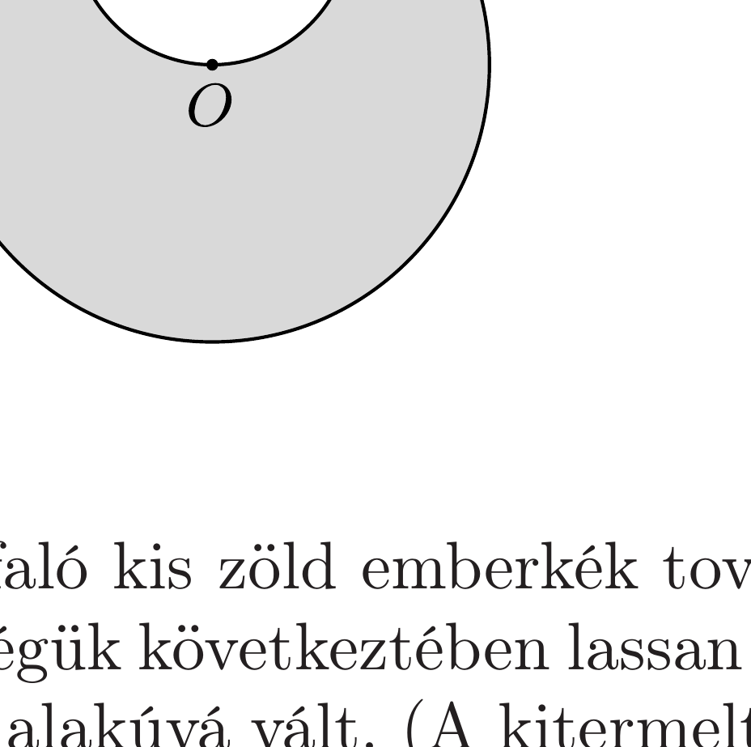

A Kozmikus Baleseteket Kivizsgáló Intézet (KOBALKIVI) a következő rövid jelentést írta egyik fizikus szakértőjének:
„A titánfaló kicsi zöld emberkék egyik kutató űrhajója rátalált egy tökéletesen gömb alakú kisbolygóra. Az $A$ pontból keskeny próbafuratot készítettek, amely eljutott a kisbolygó $O$ középpontjáig. Így megállapították, hogy a bolygót teljes egészében homogén titán alkotja. Ekkor történt az első szerencsétlenség: egy kicsi zöld emberke a felszínről a próbafuratba esett, lényegében fékezés nélkül az $O$ pontig zuhant, és ott halálra zúzta magát.

A munka azonban folytatódott, a kicsi zöld emberkék megkezdték a titán titkos kitermelését, melynek során a kisbolygó belsejében egy $A O$ átmérőjú, gömb alakú üreget hoztak létre. Ekkor történt a második baleset: egy másik zöld emberke - szintén az $A$ pontból - az $O$ pontig zuhant, és hasonló módon összezúzta magát."

A KOBALKIVI kérdése alapján a szakértőnek választ kellett adnia arra, hogy a két szerencsétlenül járt emberke esetében mekkora volt a becsapódási sebességüknek, illetve az esési idejüknek az aránya. Milyen számértékeket adott meg a szakértő a jelentésében?

