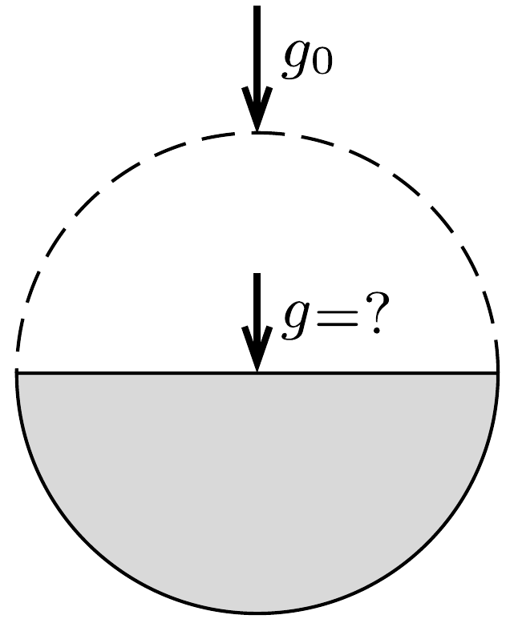

Az előző feladatban szereplő titánfaló kis zöld emberkék tovább folytatták a munkát. Környezetromboló tevékenységük következtében lassan elfogyott a kisbolygó fele, a maradék szabályos félgömb alakúvá vált. (A kitermelt anyagot elszállították a bolygóról.)

Vajon mekkora gravitációs gyorsulás mérhető a maradék félgömb körlapjának közepén, ha az eredeti (gömb alakú) kisbolygó felületén $g_{0}=9,81 \mathrm{~cm} / \mathrm{s}^{2}$ volt a gravitációs gyorsulás?

