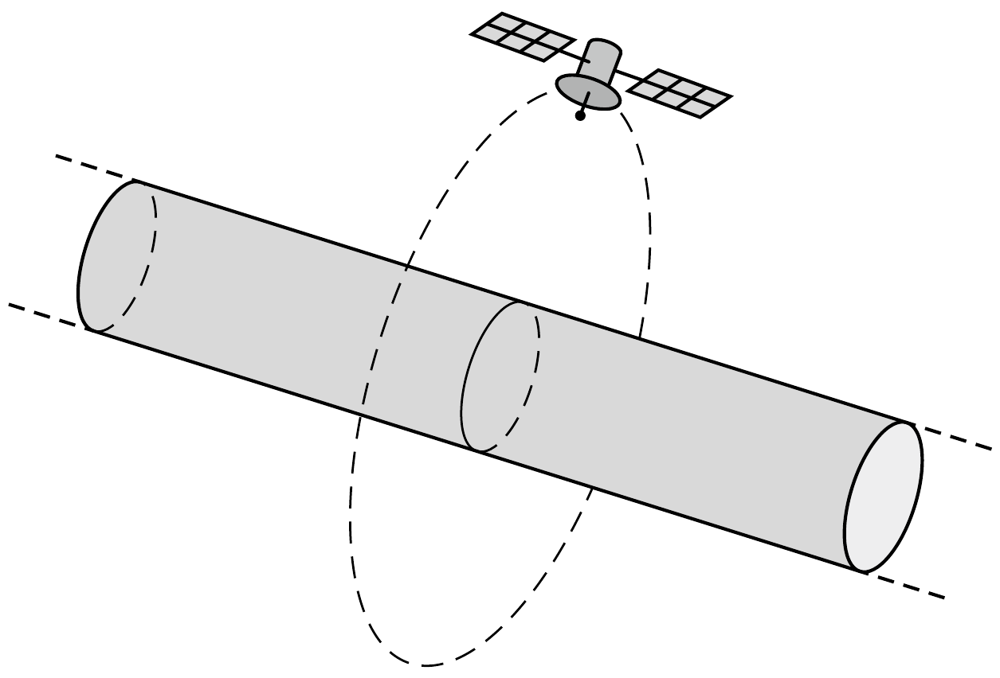

Nevenincs csillag egyik bolygója hosszú, henger alakú. A bolygó átlagsúrúsége ugyanakkora, mint a Földé, sugara is megegyezik a Föld sugarával, tengely körüli forgásának periódusideje pedig éppen 1 nap.

- a) Mekkora az első kozmikus sebesség ennél a bolygónál?
- b) A bolygó felszíne felett milyen magasan keringenek az ottani távközlési szinkronműholdak?
- c) Mekkora a második kozmikus sebesség ennél a bolygónál?
