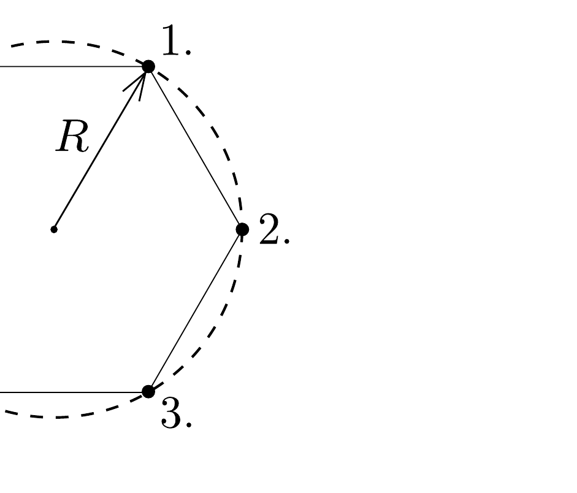

Egy szabályos $n$-szög csúcsaiban $m$ tömegú, pontszerú testek nyugszanak. Hogyan mozog a rendszer, ha a testek között csak a gravitációs erő hat? Mennyi idő múlva ütköznek össze a testek, ha $n=2,3$, illetve 10? Vizsgáljuk meg az $n \gg 1, m=M_{0} / n$ határesetet is (itt $M_{0}$ a testek adott nagyságú össztömege)!

