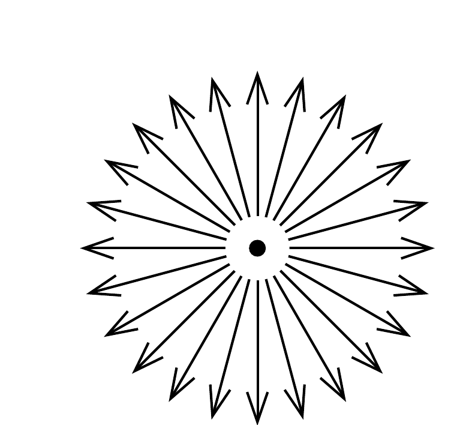
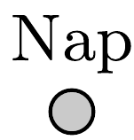

Csillagászok felfedezik, hogy parabolapályán a Nap felé közeledik két egyforma tömegú üstökös. Megállapítják, hogy impulzusnyomatékaik azonos nagyságú, de ellentétes irányú vektorok.

A két üstökös a pálya napközeli pontjában összeütközik, és különböző irányú, de azonos nagyságú sebességgel induló darabokra esik szét. Milyen alakú a törmelékdarabok további pályájának burkolófelülete?
