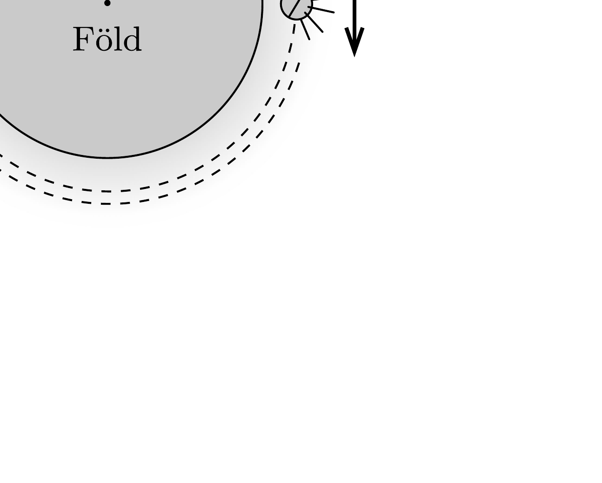

Pályafutásuk végén a sorsukra hagyott múholdak a légkör felső rétegeiben rájuk ható közegellenállási erő hatására fokozatosan veszítenek energiájukból, és végül a sürübb légrétegekbe érve elégnek. Belátható, hogy az eredetileg körpályán keringő múholdak mindvégig közelítőleg körpályán mozognak, miközben a pályasugaruk lassan csökken. Az egyik, féltonnás mühold közelítőleg körpályán kering a Föld körül, amikor magára hagyják. (A múholdra ható közegellenállási erốt $c \varrho v^{2}$ alakban adhatjuk meg, ahol $c=0,23 \mathrm{~m}^{2}, \varrho$ a levegő súrúsége a múhold magasságában, $v$ pedig a múhold sebessége.)
a) Fékeződik vagy felgyorsul a mühold a közegellenállási erő hatására? Hogyan magyarázható a válasz dinamikai szempontból?
b) A közegellenállási erő és a múhold pályamenti gyorsulása között egy egyszerú összefüggés állapítható meg. Hogy szól ez?
c) Mekkora a levegő súrúsége 200 km magasságban, ha ebbe a magasságba érve a műhold pá-

lyasugara egy fordulat alatt 100 m-rel csökken?
