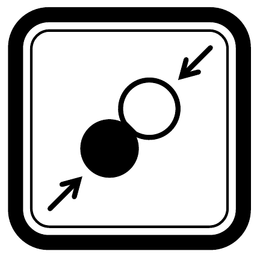

Közismert csillagászati tény, hogy a Hold (nagyjából) mindig ugyanazt az oldalát mutatja a Föld felé. Ez az érdekesség nem véletlen egybeesés, hanem a Föld és a Hold között ható árapályerők közvetlen következménye: az árapályerők ugyanis az idők folyamán folyamatosan fékezték a Hold tengely körüli forgását egészen addig, amíg annak periódusideje egyenlővé vált a Föld körüli keringésének periódusidejével. Ugyanezen ok miatt a Föld tengely körüli forgása is folyamatosan lassul, miközben a Hold keringési sebessége egyre csökken.
a) Becsüljük meg, hogyan aránylik egymáshoz a Föld és a Hold mozgási energiájának csökkenési üteme!
b) Az Apollo-program keretében lézertükröt is juttattak a Holdra. Az ezzel végzett igen pontos mérések szerint a Hold évente 3,8 cm-t távolodik a Földtől. A mért adat alapján becsüljük meg, mennyit változik a földi nap hossza évente!
c) Ha a Föld-Hold rendszer zavartalanul folytathatná mozgását, az árapályerők fékező hatása miatt elegendően hosszú idő elteltével a Föld is mindig ugyanazt az oldalát mutatná a Hold felé, azaz a két égitest forgása és egymás körüli keringése szinkronizálódna. (Valójában a Nap előbb fúvódik fel vörös óriássá, és kebelezi be a belső bolygókat.) Hányszorosára növekedne a teljes szinkronizálódásig a földi nap hossza és a Föld-Hold távolság?
(Feltételezhetjük, hogy a Hold pályája mindvégig közelítőleg kör marad, a Nap árapálykeltő hatásától pedig tekintsünk el!)

\section*{Pontrendszerek}
