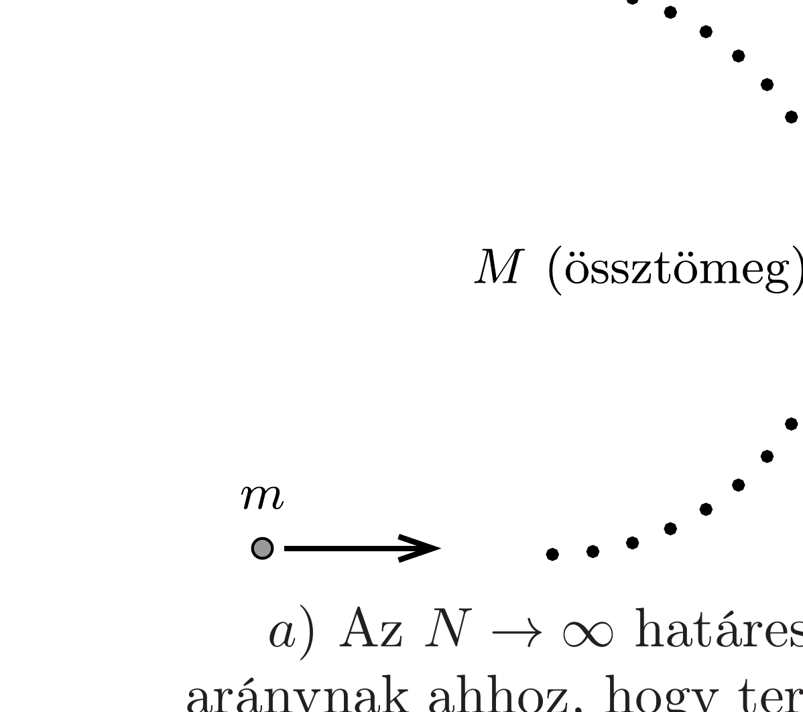

Egy $m_{1}$ és $m_{2}$ tömegú rugalmas labdát egymás fölé helyezünk (a labdák között kicsiny rést hagyva), majd $h$ magasságból elengedjük őket. (Feltehetjük, hogy $h$ sokkal nagyobb a labdák átmérőjénél.)
a) Milyen tömegarány esetén jut a rendelkezésre álló energiából

a legtöbb a felső labdának?
b) Legfeljebb milyen magasra repülhet a felsó labda?

