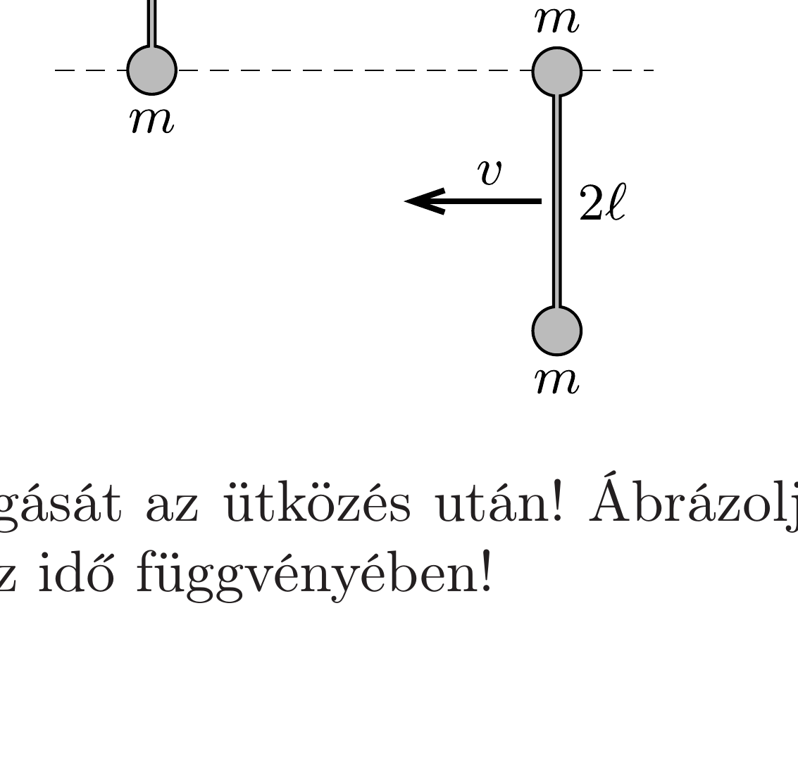

Kis méretú, $m$ tömegú korongokból és elhanyagolható tömegü, $2 \ell$ hosszú rudakból két egyforma „súlyzót” készítettünk. A súlyzókat vízszintes, légpárnás asztalra helyezzük, majd az ábrán látható módon (forgás nélkül) $v$ sebességgel egymás felé indítjuk őket.

Írjuk le a súlyzók mozgását az ütközés után! Ábrázoljuk a súlyzók tömegközéppontjának sebességét az idő függvényében!
