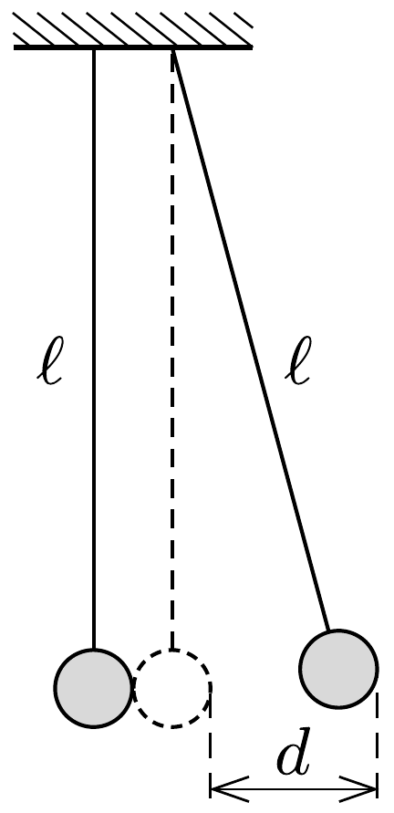

Közvetlenül egymás mellé felfüggesztett két egyforma golyó az ábra síkjában lenghet $\ell$ hosszúságú fonálon. Az egyik golyót $d$ távolságra kimozdítjuk és elengedjük $(d \ll \ell)$. A golyók rugalmatlanul ütköznek, sebességük a tömegközépponti rendszerben minden ütközéskor $k$-szorosára csökken ( $0<k<1$ az ütközési szám).

Hogyan mozognak a golyók? Mekkora lesz a lengések amplitúdója sok ütközés után?

