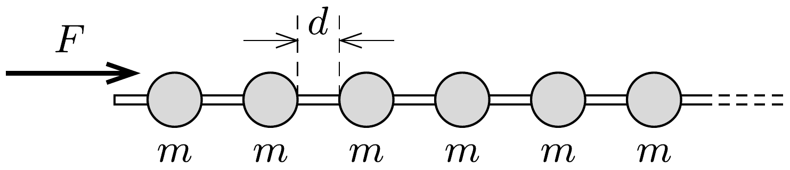

Egy hosszú, vízszintes drótra nagyon sok egyforma, $m$ tömegü gyöngyszemet füztünk fel egymástól azonos, $d$ távolságra. A gyöngyszemek kezdetben nyugalomban vannak, és súrlódásmentesen mozoghatnak.

Az egyik gyöngyöt állandó $F$ eróvel gyorsítani kezdjük, és ezt az erőt a továbbiakban is fenntartjuk. Mekkora lesz hosszú idő múlva a gyorsított gyöngy sebessége, illetve a „lökéshullám" elejének sebessége, ha a gyöngyök ütközése
- a) tökéletesen rugalmatlan,
- b) tökéletesen rugalmas?
