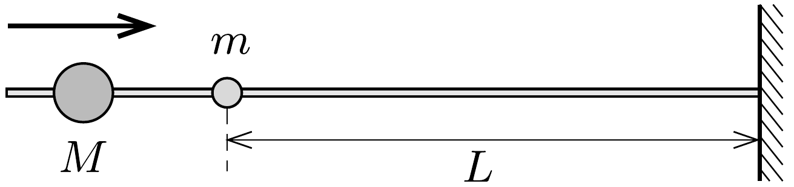

Egy falból kiálló, vízszintes, súrlódásmentes rúdra két kis méretú golyó van felfúzve. Az egyik, $M$ tömegú, nehéz golyó közeledik a fal felé, a másik, $m$ tömegú, könnyú golyó a faltól $L$ távolságra nyugalomban van. Rugalmas ütközésük után az $m$ tömegú golyó a fal felé csúszik, azzal rugalmasan ütközik, majd elindul az $M$ tömegú golyó irányába, azzal ismét ütközik és a folyamat ismétlődik.

Mekkora távolságra közelíti meg az $M$ tömegú golyó a falat? (Feltehetjük, hogy $m \ll M$, és a golyók pontszerúek.)
