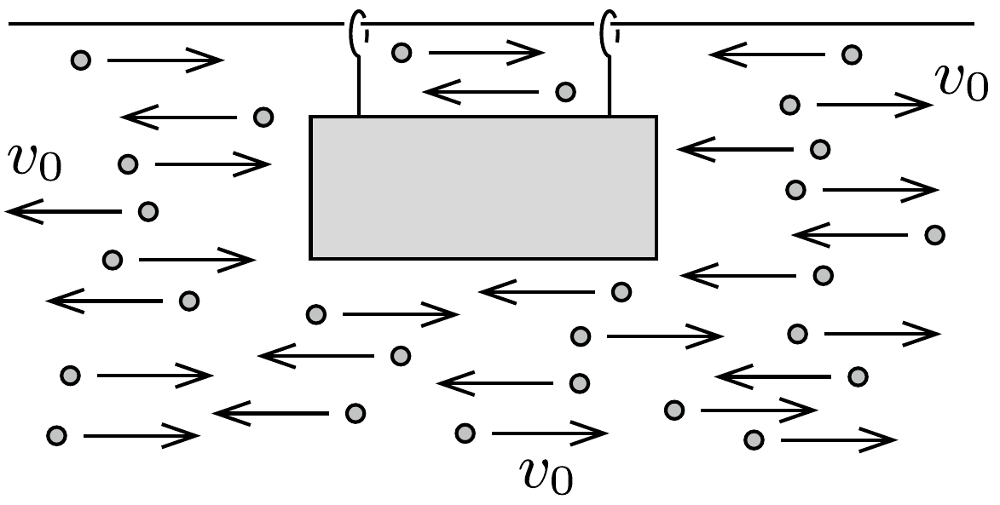
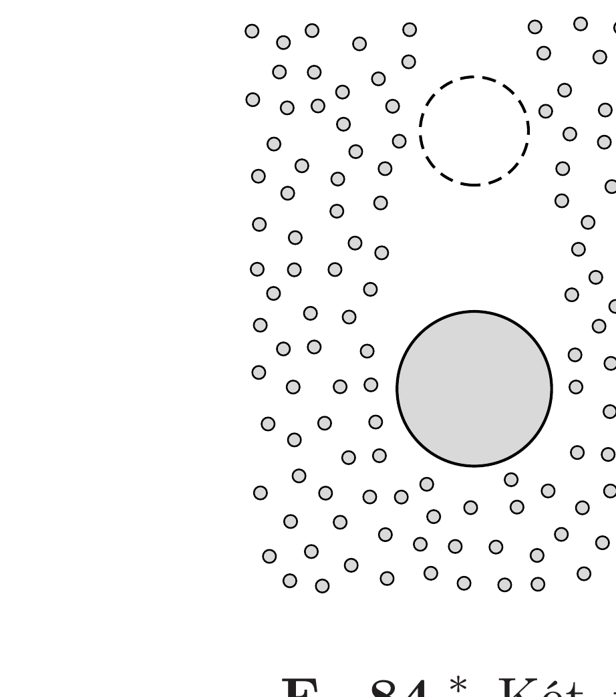

Egy „gondolatkísérletben“ egy hengeres test súrlódásmentesen mozoghat a vízszintes szimmetriatengelyével párhuzamos egyenes mentén. A test körül vízszintesen, jobbra-balra $v_{0}$ sebességú, parányi részecskék mozognak az ábra szerint. Ezek a részecskék lehetnek pl. apró golyócskák, de akár egy nagy méretú tartályban lévő, adott hőmérsékletú gáz molekulái is. (A gázmolekulák mozgását - az egyszerúség kedvéért - egydimenziósnak tekintjük, és a sebességük nagyságát az átlagsebességgel helyettesítjük.)

A részecskék a henger jobb oldali körlapjával tökéletesen rugalmasan, a bal oldali körlappal pedig tökéletesen rugalmatlanul ütköznek. (A rugalmatlan ütközések után a részecskék nem tapadnak a hengerhez.)

Mekkora lesz a henger sebessége
- $a)$ viszonylag hosszú idő múlva;

- $b$ ) nagyon hosszú idő múlva?

