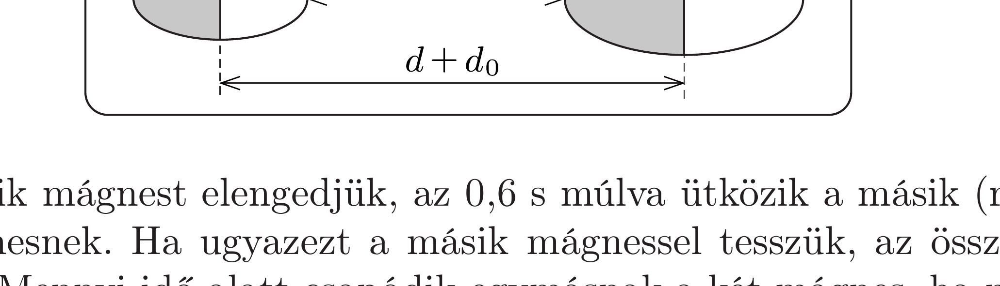

Két mágnest egymástól bizonyos $d$ távolságban egy vízszintes, nagyon csúszós síklapra helyezünk. Ekkor a két test tömegközéppontja (a véges méretük miatt) $d$-nél messzebb, valamekkora $d+d_{0}$ távolságban van egymástól. A mágneseket olyan helyzetben tartjuk, hogy egymásra csak vonzóerőt fejtsenek ki, forgatónyomatékot nem.

Ha az egyik mágnest elengedjük, az $0,6 \mathrm{~s}$ múlva ütközik a másik (rögzítetten tartott) mágnesnek. Ha ugyazezt a másik mágnessel tesszük, az összeütközésig 0,8 s telik el. Mennyi idő alatt csapódik egymásnak a két mágnes, ha mindkettőt egyszerre engedjük el?

\section*{Merev testek dinamikája}
