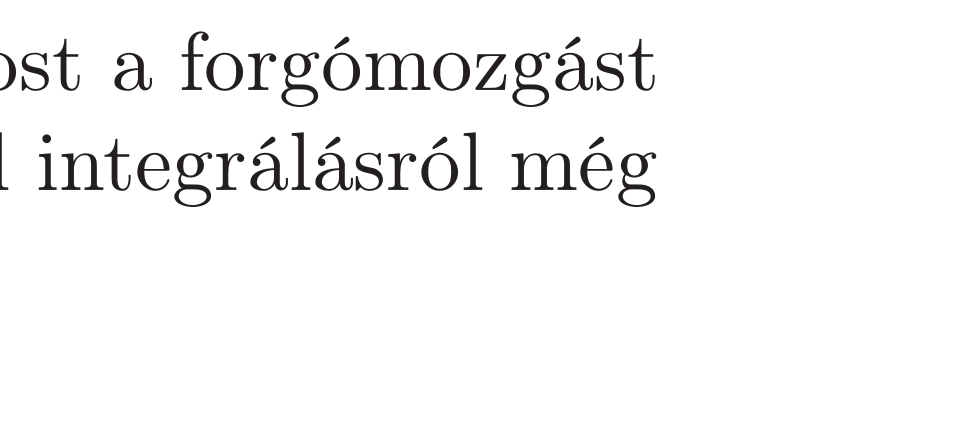

Karcsi elsőéves egyetemi hallgató, aki matematikából éppen az integrálszámítást tanulja. Gyakorlásként egy $R$ sugarú, homogén anyageloszlású félkörív tömegközéppontjának helyét kell meg-

határoznia.

Öccse, Jancsi, még csak tizedik osztályos gimnazista, ők most a forgómozgást tanulják fizikából. Érdeklődve nézi bátyja számolását, de mivel integrálásról még
soha nem hallott, nem sokat ért belőle. Mindössze annyi világos számára, hogy mi a feladat. Némi gondolkodás és egy rövid számolás után Jancsi felkiált: „Megvan az eredmény, sőt, nemcsak a félkörív, hanem tetszőleges alakú körív és körcikk tömegközéppontját is meg tudom határozni!"

Vajon hogyan csinálta?
