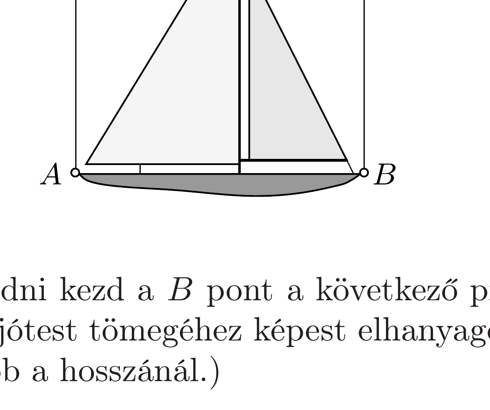

Az ábrán látható módon, két gumiszálra kötve egy miniatűr vitorláshajó függ a játékbolt kirakatában. A bal oldali gumiszálat lökés nélkül elnyisszantjuk.

Süllyedni vagy emelkedni kezd a $B$ pont a következő pillanatban? (Az árboc és a vitorlák tömege a hajótest tömegéhez képest elhanyagolható, a hajótest függőleges mérete jóval kisebb a hosszánál.)
