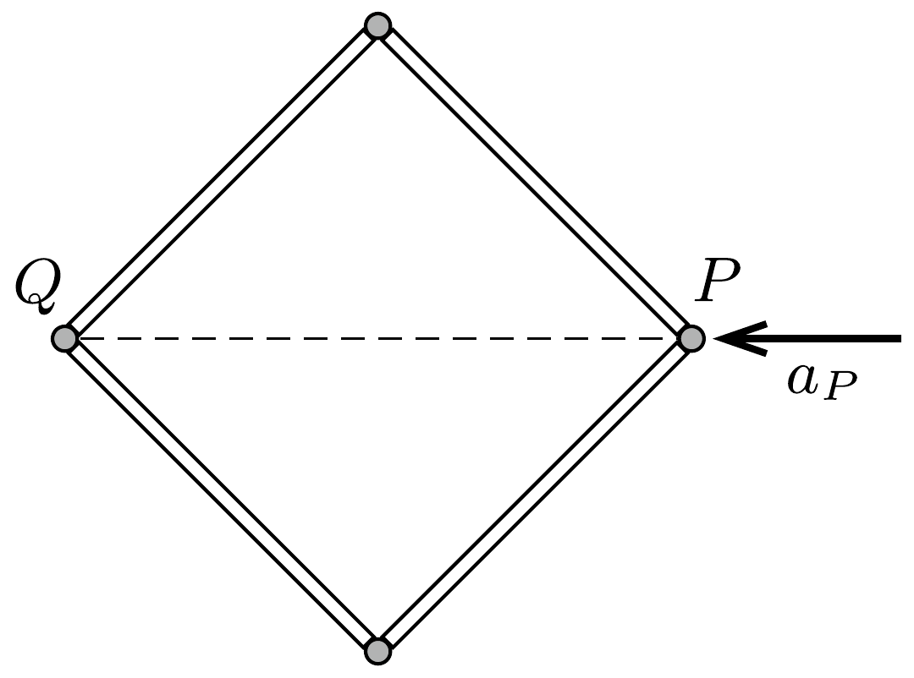

Egyenes, merev, egyenletes vastagságú hajszál fekszik egy súrlódásmentesnek tekinthetó asztalon. A hajszál két végén egy-egy bolha ül. Mutassuk meg, hogy ha a hajszál $M$ tömege nem túlságosan nagy a bolhák egyforma $m$ tömegéhez képest, akkor a bolhák képesek arra, hogy ugyanakkora kezdősebességgel, ugyanolyan kezdeti emelkedési szöggel egyszerre elugorjanak a hajszál két végéről, majd úgy érkezzenek le a hajszál másik végére, hogy nem ütköznek össze a levegőben!

