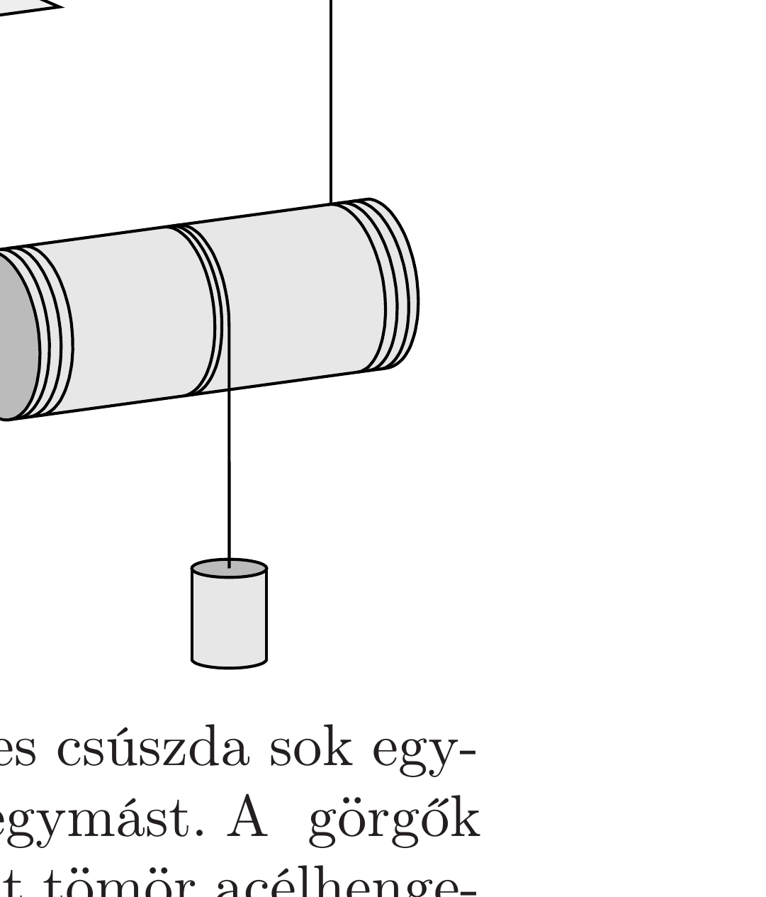

Egy hengeres testre szorosan vékony, kettós fonalat csévélünk az ábra szerint, majd a fonalak végeit a mennyezethez erősítjük. A henger közepére egy másik fonál is fel van tekerve, melynek szabad végére egy súlyos testet kötünk.

A rendszert az ábrán látható helyzetből elengedjük. Mekkora gyorsulással kezd mozogni a súlyos test az elengedés után? (A fonalak az indításkor függőlegesek, nem zavarják egymás mozgását, a henger tömegeloszlása hengerszimmetrikus.)

