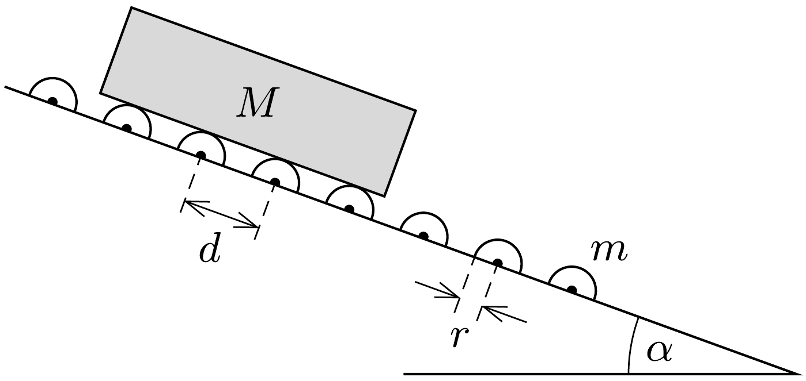

Egy hosszú, a vízszintessel $\alpha$ szöget bezáró egyenes csúszda sok egyforma görgőből áll, melyek középpontjai $d$ távolságra követik egymást. A görgők vízszintesen tengelyezett, $m$ tömegü, $r$ sugarú, gumival borított tömör acélhengerek. A csúszda tetején elengedünk egy $M$ tömegú deszkát, melynek hossza sokkal nagyobb a $d$ távolságnál.

Mekkora $v_{\text {max }}$ (kicsiny ingadozásoktól eltekintve) állandósult sebességre gyorsul fel a deszka, ha kezdetben a görgők nem forogtak? (A közegellenállástól és a tengelysúrlódástól eltekinthetünk.)
