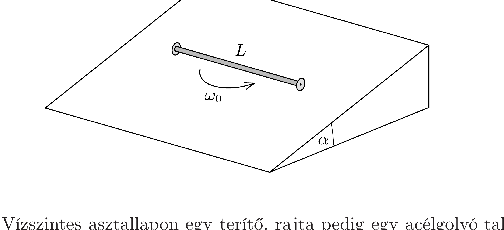

Egy $L$ hosszúságú, homogén tömegeloszlású rúd végein kicsiny, elhanyagolhatú tömegú görgők találhatók, melyek egymástól függetlenül, súrlódásmentesen foroghatnak a rúd tengelye körül.
a) Hogyan mozog a görgős rúd, ha vízszintes, érdes felületre helyezzük, majd két végét a tengelyére meróleges $v_{1}$ és $v_{2}$ sebességgel megpöccintjük?
b) Hogyan mozog a rúd, ha $\alpha$ hajlásszögú, nagy kiterjedésú, érdes lejtőre helyezzük, majd az ábrán látható helyzetből $\omega_{0}$ szögsebességgel, zérus tömegközépponti sebességgel elindítjuk?

