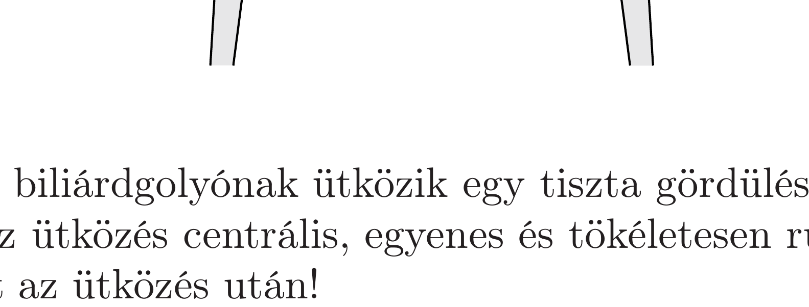

Vízszintes asztallapon egy terítő, rajta pedig egy acélgolyó található. A terítőt kihúzzuk a golyó alól, eközben a golyó a súrlódási erón miatt mozgásba jön, és forogni is kezd. Mekkora lesz a sebessége az asztalon, amikor már csúszásmentesen gördül? (Az asztal elég nagy méretú, a golyó nem esik le róla.)

