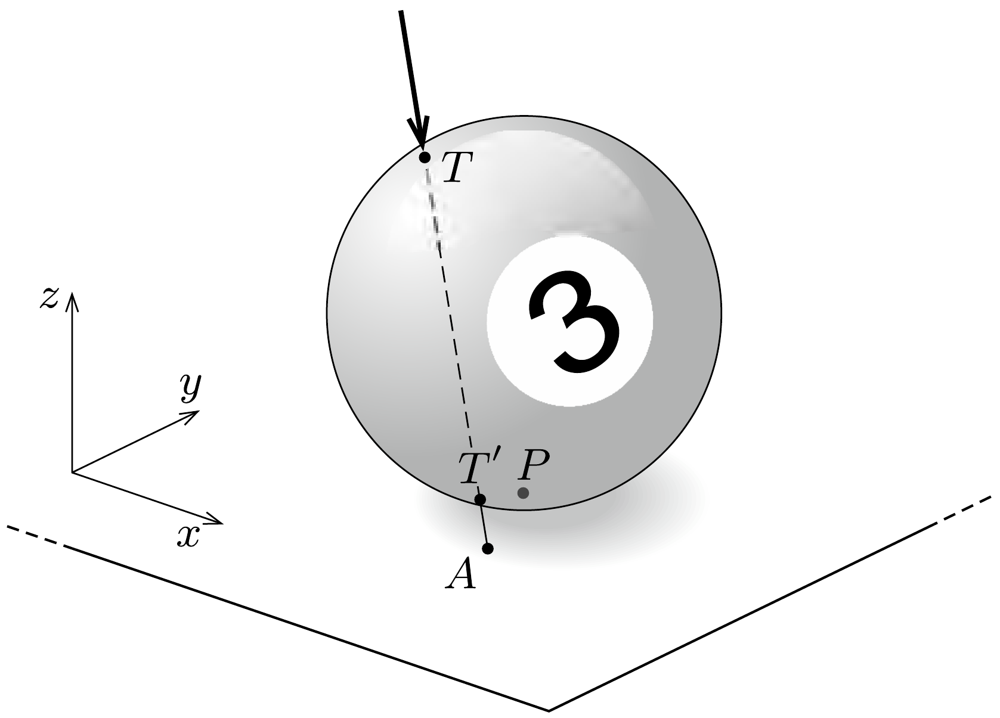

Ha az előzó feladatban az erólökés hatásvonala nincs benne a $T$, $C, P$ pontok által meghatározott síkban, akkor a lökés utáni pillanatban a biliárdgolyó szögsebességvektora nem lesz merőleges a tömegközéppont sebességére. A biliárdjátékosok ezt Coriolis-massé lökésnek hívják. (Az ábrán $T^{\prime}$-vel és $A$-val jelöltük az erőlökés hatásvonalának a golyó felületével, illetve az asztal síkjával való döféspontjait.)
a) Az indítást követően milyen alakú pályán mozog a golyó középpontja a csúszva gördüló mozgás befejeztéig?
b) A tiszta gördülés kezdetétől milyen irányban folytatja mozgását a golyó a $P A$ egyeneshez képest?
(Tételezzük fel, hogy a golyó mindvégig egyetlen ponton érintkezik az asztallal.)

