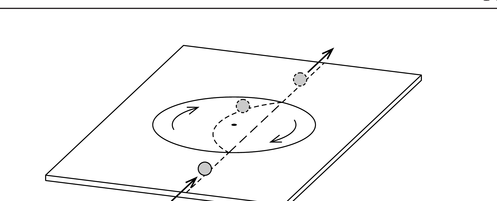

Ausztráliában, a canberrai „Csodák Palotájában” látható a következő berendezés. Egy vízszintes asztallap közepéből kivágtak egy $R$ sugarú korongot, és azt - csapágyazva - visszahelyezték az eredeti helyére. A korongot egy motor segítségével egyenletes forgásban tartják.

Ha az asztalon egy tömör gumilabdát (trükklabdát) gurítunk végig, akkor a labda a forgó korongra érve letér az eredeti egyenes pályájáról, ívesen eltérül, majd a korongról lekerülve ismét tiszta gördüléssel, egyenes vonalban folytatja útját. Ez az egyenes pontosan egybeesik a kezdeti mozgás egyenesével, és a labda végsebessége is ugyanakkora lesz, mint amekkora a korongra érkezés előtt volt.

Vajon milyen megmaradási törvények rejtőznek emögött?
