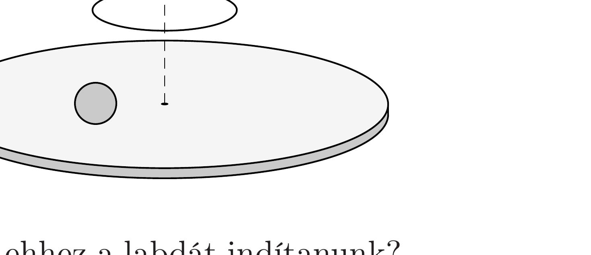

Egy érdes felületú, vízszintes síkú korongot függőleges szimmetriatengelye körül állandó $\Omega$ szögsebességgel forgatunk. A forgó korongra egy $R$ sugarú, tömör gumilabdát helyezünk, majd tiszta gördüléssel elindítjuk úgy, hogy a labda középpontja egy, a koronggal

koncentrikus, $r_{0}$ sugarú körpályán mozogjon.
- a) Milyen kezdősebességgel és szögsebességgel kell ehhez a labdát indítanunk?
- b) Hogyan mozogna a labda középpontja, ha azt az $a$ ) kérdésben meghatározott nagyságú, de azzal ellentétes irányú kezdősebességgel, ugyanonnan indítanánk?

A labda mindkét esetben végig tisztán gördül, és a korong mérete elegendően nagy ahhoz, hogy a labda ne essen le róla.
