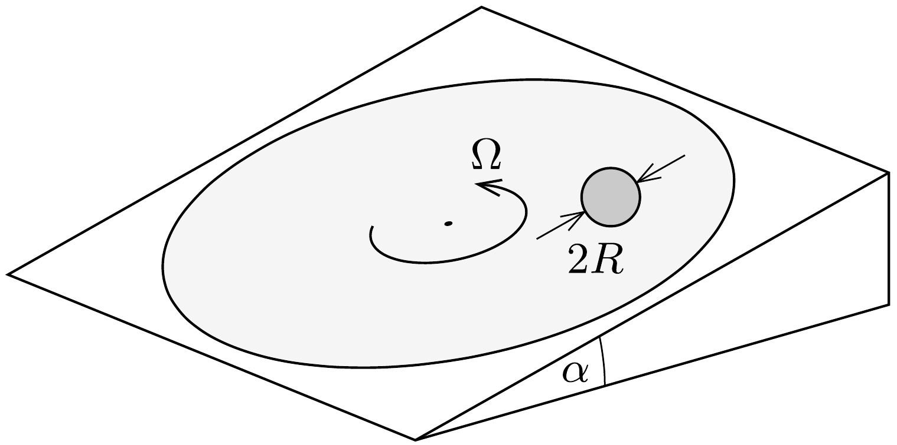

Egy nagy méretú, érdes felületú, a vízszinteshez képest $\alpha$ szögben döntött korong egyenletesen, $\Omega$ szögsebességgel forog. Egy búvész a forgó korongra egy $R$ sugarú, tömör gumilabdát helyez, majd megfeleló irányban elgurítja. A közönség ámulatára a labda középpontja ezután egyenes vonalú, egyenletes mozgást végez, amit mindaddig folytat, amíg a labda a forgó korong peremére ér. (A labda mindvégig tisztán gördül, a korong szögsebessége nem változik.)

Adjunk fizikai magyarázatot a furcsa jelenségre! Milyen irányban és mekkora sebességgel kell indítania a búvésznek a labdát, hogy a mutatvány sikerüljön?
