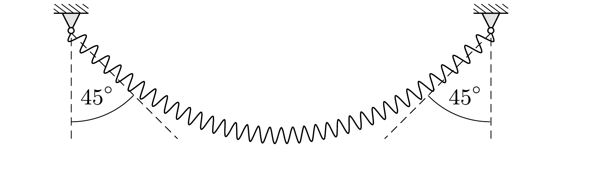

A slinky-rugó ${ }^{2}$ egy olyan rugó, melynek nyújtatlan hossza elhanyagolhatóan kicsi, jó közelítéssel követi a Hooke-törvényt, és már a saját súlya hatására is számottevően megnyúlik. Ezt a rugót egyszer az egyik végénél fogva függőlegesen lógatjuk, másszor mindkét végét rögzítjük olyan távolságban, hogy a rugó az ábrán látható alakot vegye fel. Melyik esetben hosszabb a megnyúlt rugó?

