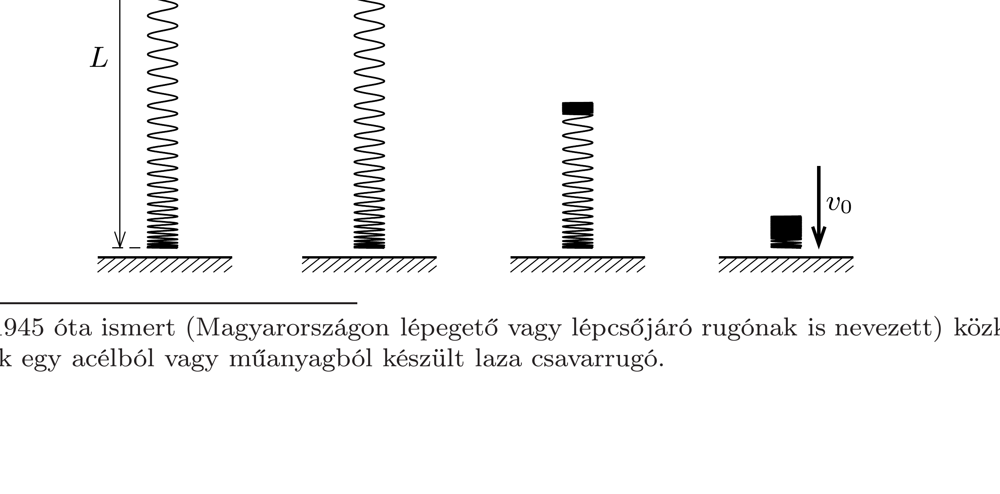

Az asztalon nyugvó, $m$ tömegú slinkyt felső végénél fogva lassan addig emeljük, hogy az alsó vége éppen felemelkedjen. Ekkor a slinky hossza $L$.
- a) Mekkora munkát végeztünk az emelés közben?
- b) Ha ezután a felső végénél fellógatott slinkyt elengedjük, a legalsó menet érdekes módon egészen a teljes összecsukódásig nem mozdul meg (lásd az ábrasor „pillanatfelvételeit”). Mekkora $v_{0}$ sebességgel kezd esni a slinky közvetlenül a teljes összecsukódás után?
- c) Mennyi idő alatt csukódik össze teljesen a slinky?

\footnotetext{
${ }^{2}$ Az 1945 óta ismert (Magyarországon lépegető vagy lépcsőjáró rugónak is nevezett) közkedvelt játék egy acélból vagy múanyagból készült laza csavarrugó.
