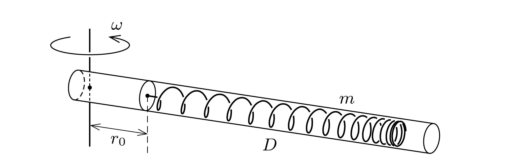

Egy slinky-rugót csúszós (súrlódásmentes) csőbe helyezünk, és a rugó egyik végét a cső egy pontjához rögzítjük. A vízszintes csövet a rugó rögzített végétől $r_{0}$ távolságban lévő függőleges tengely körül $\omega$ szögsebességgel egyenletes forgásba hozzuk.

Mekkora lesz a megnyúlt rugó $\ell$ hossza, ha a slinky rugóállandója $D$, össztömege $m$ ? A rugó „ideális”: hossza feszítetlen állapotban elhanyagolható, korlátlanul nyújtható és mindvégig követi a Hooke-törvényt.

Vizsgáljuk meg az $r_{0} \rightarrow 0$ határesetet!
